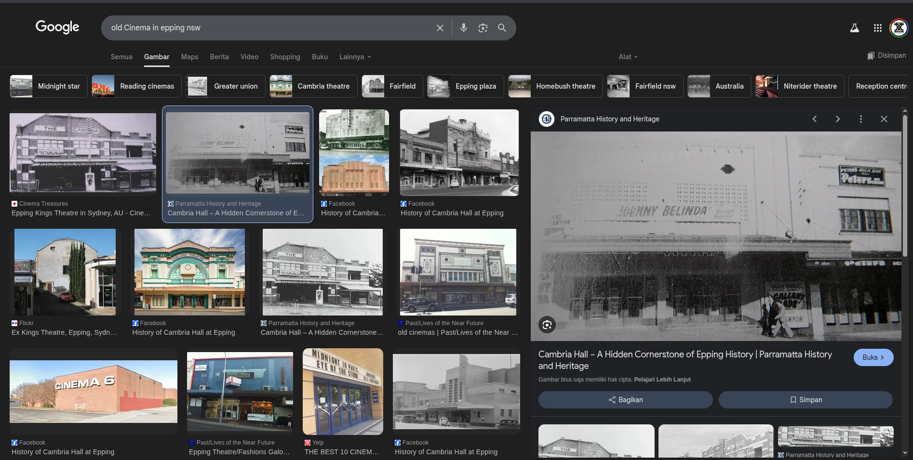
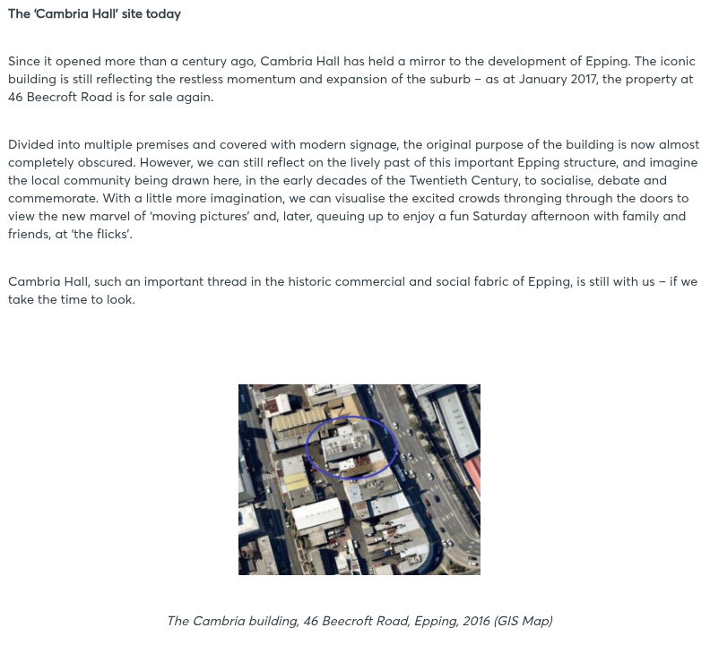

## Love GranniE - DUCTF 2025 Write-up


**Challenge:** Love GranniE
**Category:** OSINT
**Points:** 100
**Author:** MinousE3

### Introduction
In this challenge, we receive a wholesome email from "Grannie E", who shares a nostalgic story about revisiting an old movie theatre she used to go to. Along with the email, there's a black-and-white photograph that she says was taken from back when she used to live in the area.


Our task is to identify the name of the building, the street address (including number), and the suburb it's in, based on the image. The final flag should be in the format:

```
DUCTF{BuildingName_StreetAddress_Suburb}
```

### Investigating the Image [`FromGranniE.jpg`](assets/img/FromGranniE.jpg)
We begin by examining the attached photo: [`FromGranniE.jpg`](assets/img/FromGranniE.jpg). It's a historical black-and-white image showing people in early 20th-century attire walking up a wooden pedestrian bridge beside a railway cutting. Definitely gives off old train station vibes.

To dig deeper, I used **Google Lens** to do a reverse image search — and boom, we get an exact match.


The image appears in an official government document from the [`NSW Transport website`](https://www.transport.nsw.gov.au/system/files/media/documents/2024/Epping-Bridge-Project-Frequently-Asked-Questions-for-concept-design-and-Review-of-Environmental-Factors.pdf). This PDF details the Epping Bridge Project, and includes the exact same photo (but in a wider frame), credited to around the 1920s.


According to the document, the photo was taken from Epping Station, and the bridge in the background is Epping Bridge — a wooden pedestrian bridge that has since been modernized.

So from this, we learn that Grannie E used to live in Epping, a suburb of Sydney, New South Wales and we’re on the right track for narrowing down the cinema location nearby.

### Method
One line in GranniE’s email really stood out:

*“Back in my day movies didn’t talk or have sound!”*

That immediately tells us we’re looking for a cinema from the **silent film era**, which spanned from the **mid-1890s to the late 1920s**. So, the goal is to find a historic cinema in Epping, NSW that fits that timeline.

I started with a simple Google search: `old cinema in Epping NSW`

This returned several promising results, many pointing to a place called Cambria Hall.



To confirm, I opened [`this article from the City of Parramatta’s history blog`](https://historyandheritage.cityofparramatta.nsw.gov.au/blog/2017/02/03/cambria-hall-a-hidden-cornerstone-of-epping-history), and sure enough — Cambria Hall was used for **silent movie screenings**, complete with piano accompaniment (often drowned out by nearby steam trains). The building was known as **“The Cambria Hall”**.


Even better, the article confirms its address:
```
46 Beecroft Road, Epping, NSW
```



That aligns perfectly — it's near **Epping Station**, matches the time period, and fits the story.

However, the challenge includes a helpful note:

*“Sometimes old records get out of date, you might need to try the street number next door.”*

Just to be safe, we shift to 47 Beecroft Road — the next number along.

Now that we’ve confirmed the building name, address, and suburb, we can put everything together in the required format:

```
flag: DUCTF{TheCambriaHall_47BeecroftRoad_Epping}
```