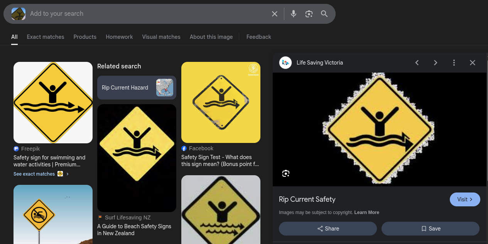
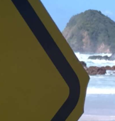
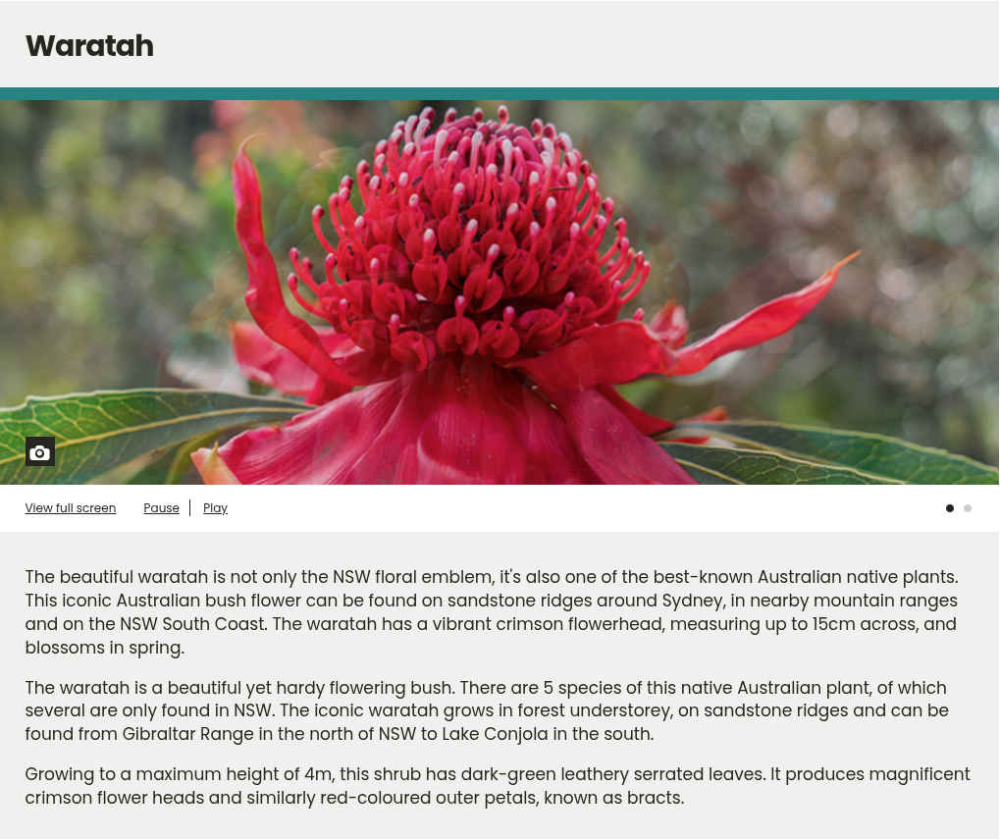
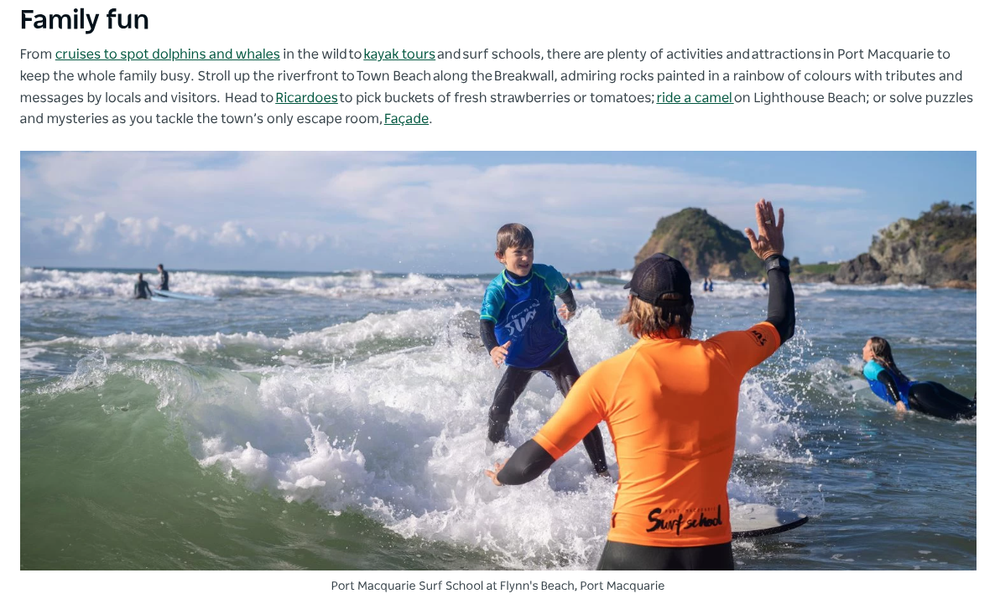
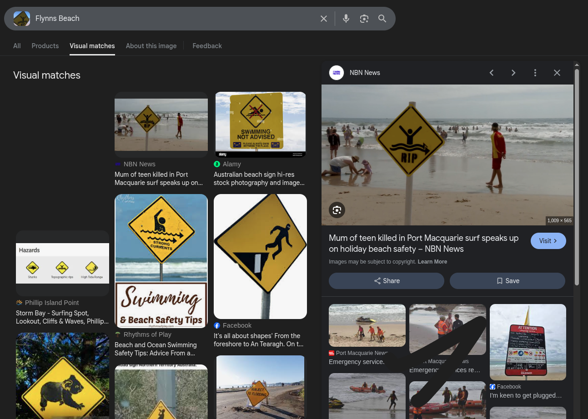

## yippee - DUCTF 2025 Write-up


**Challenge:** yippee
**Category:** OSINT
**Points:** 146
**Author:** MinousE3

### Introduction
In this challenge, we’re given a single photograph — it shows a RIP current warning sign on a beach, with a small hill visible in the right corner. There's no caption or text to go on, but the back of the photo has a hand-drawn Waratah flower.


Our task is to figure out where this photo was taken. Once we identify the correct location, we submit it in the following format:
```
DUCTF{}
```
Case-insensitive, no spaces.

### Analyzing the Image
We begin by closely examining the provided photo. It shows a **RIP current warning sign** placed on a beach, with a **small hill or headland visible in the right corner** of the frame. There’s no visible text identifying the location, but we can still pull out a few key clues.

One major detail is the **RIP current sign** itself. These types of signs are **commonly found on Australian beaches**, especially those that are monitored by **Surf Life Saving Australia** (SLSA). To confirm this, I performed a **reverse image search** and found the **exact same image — but without the “RIP” text** — featured in an [`official safety activity PDF from Life Saving Victoria`](https://lsv.com.au/wp-content/uploads/1.RCS_SafteySigns_Activity_1.pdf).



This confirms that the sign is based on standard beach safety signage used across Australia — particularly in areas with lifeguard monitoring and known hazards.

Another important detail is the small hill or elevated land in the right-hand portion of the image. This suggests that the photo was taken at a beach with some nearby elevation, such as a headland, dune, or sloped terrain.



Finally, on the back of the photo, there’s a hand-drawn Waratah flower — the floral emblem of New South Wales. While subtle, it’s a clear hint pointing us toward a location along the NSW coastline.



### Narrowing Down the Location
With the clues pointing us toward New South Wales, the next step was to focus on the small hill visible in the image. Since it was the only distinctive landscape feature in the photo, I used Google Lens to reverse image search just the hill portion — and that’s when things got interesting.


The top results placed the location in Port Macquarie, a coastal town in northern New South Wales. One of the top links led to a regional tourism website, which is [`Visit NSW – Port Macquarie`](https://lsv.com.au/wp-content/uploads/1.RCS_SafteySigns_Activity_1.pdf).

Scrolling through the article, I found a photo showing a surf school activity on a beach, and in the background was the exact same hill — same angle, same slope. According to the caption, the beach in the image was Flynns Beach.



To double-check, I went back and did a reverse image search using the full yippee.png (the challenge image) with the term “Flynns Beach”. Sure enough, one of the results showed the same RIP current sign — confirming that both the terrain and the signage matched up.



With that, the location in the image is confirmed to be:

```bash
flag: DUCTF{FlynnsBeach}
```