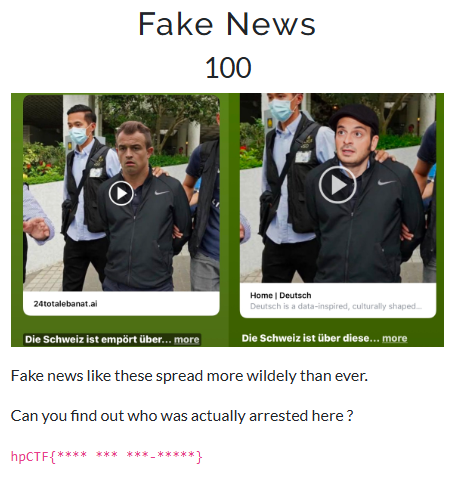
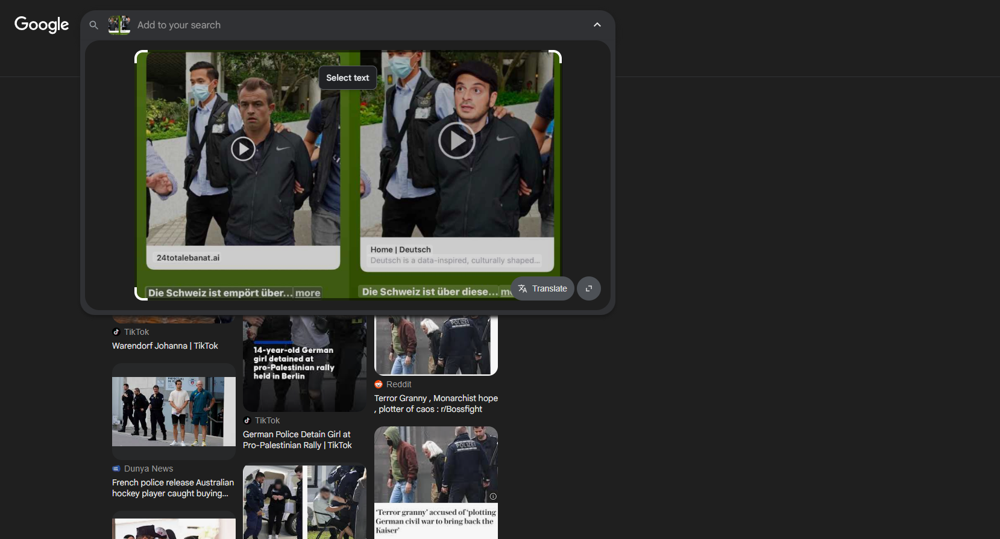

## Fake News - Haunted Pumpkin CTF '25 Write-up



**Challenge:** Fake News
**Category:** OSINT
**Points:** 100
**Author:** minouse3

### Introduction
In this challenge, We are given 2 screenshots of hoax news regarding someone's arrest. Our task is to find out who the real person arrested in the news is. 


The flag should be in the format:
```
hpCTF{**** *** ***-*****}
```

### How to find that guy?
It's actually quite simple. You just need to perform a Reverse Image Search (RIS) on the image.



However, I don't know why the RIS results when I was writing this write-up challenge were different. It should only return one exact match. But when I did it again while writing this write-up, I had to scroll all the way down to find the exact same image.


After that, you can open the website that published [the news](https://www.clickorlando.com/gallery/news/2021/06/17/apple-daily-editors-arrested-under-hong-kong-security-law/) and you will see the real name of the person who was arrested, which is Apple Daily's Chief Editor, Ryan Law.


However, if we look back at the challenge, we can see that the flag content is quite long. So, we need to find Ryan Law's full name. We just need to google it and and we will find it immediately, which is Ryan Law Wai-kwong.


### Flag
```
hpCTF{Ryan Law Wai-kwong}
```