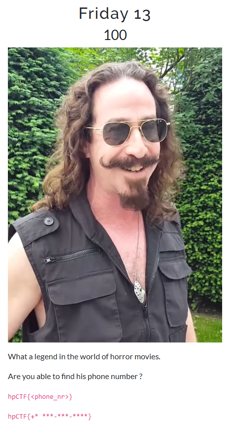
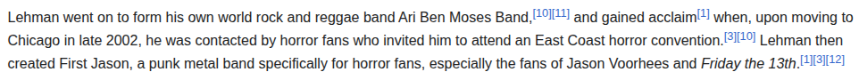

## Friday 13 - Haunted Pumpkin CTF '25 Write-up



**Challenge:** Friday 13
**Category:** OSINT
**Points:** 100
**Author:** minouse3

### Introduction
In this challenge, We are given a picture of a man that play in old popular horror movies. They want us to find the man phone number.

The flag should be in the format:
```
hpCTF{+* ***-***-****}
```

### How to find this man's phone number?
First, we need to know who is he. We can do a Reverse Image Search (RIS) and we will immediately find out that it is a photo of Ari Lehman, an artist, composer, and actor of the character Child Jason Voorhees in the film Friday the 13th.


To find his phone number, we need to remember that he is an American, which make his phone number available in American Phone Books. There are multiple website that you can use to access the American Phone Books, but you will probably need to use United States VPN, because some websites will block other countries, besides United States. In my case, I will use [FastPeopleSearch](https://www.fastpeoplesearch.com/).


But as you can see, we need his City & State or his Zip Code to make the search more precise. To get that, i will just use WikiPedia, and you will see some info about him, which says that he was later moved to Chicago, Illinois.



After finding his City & State, we can search his phone number precisely.


And tadaa! We find his phone number, which is (773) 266-4418 and we will use +1 for USA Country Code.

### Flag
```
hpCTF{+1 773-266-4418}
```