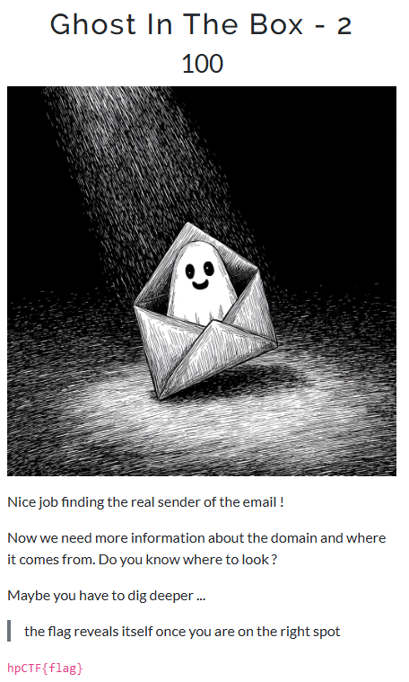
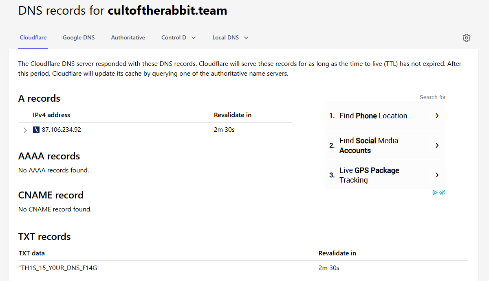

## Ghost in The Box 2 - Haunted Pumpkin CTF '25 Write-up



**Challenge:** Ghost in The Box - 2
**Category:** OSINT
**Points:** 100
**Author:** minouse3

### Introduction
This challenge is a continuation of the Ghost in The Inbox challenge. After finding the email, we need to find more information about the domain on their email.

The flag should be in the format:
```
hpCTF{flag}
```

### What should we do?
So, after knowing their email, which is ctf@cultoftherabbit.team, we can see that they're using a custom domain on their email extension, which is cultoftherabbit.team. 

By looking at the hint, it's pretty clear that they want us to look the information of the domain, which is the DNS Records. They also give us on hint that lead to one of the tools, which is 'dig' and we need to find the correct records to get the flag.

Because I'm too lazy to use 'dig', we can just use a web-based DNS Lookup or DNS Check, which can give us all DNS Records inside that domain. I will use [nslookup.io](nslookup.io).



Just by looking at the TXT Records, we already got the flag and you just need to insert it to the flag format.

### Flag
```
hpCTF{TH1S_15_Y0UR_DNS_F14G}
```