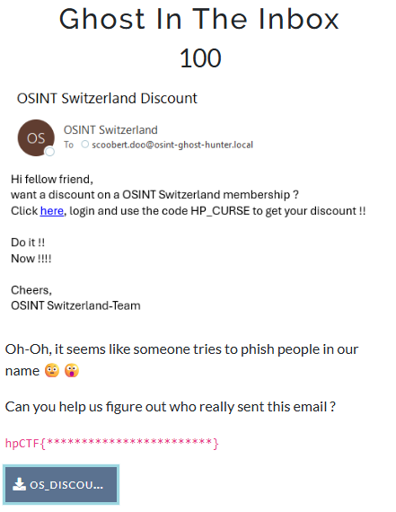
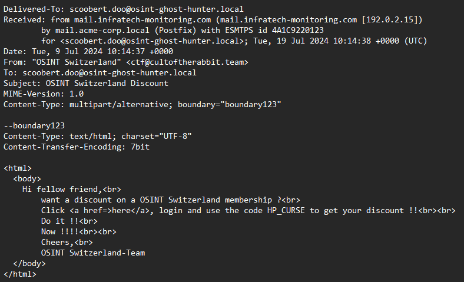

## Ghost in The Inbox - Haunted Pumpkin CTF '25 Write-up



**Challenge:** Ghost in The Inbox
**Category:** OSINT
**Points:** 100
**Author:** minouse3

### Introduction
In this challenge, We are given a screenshot of an email from someone named "OSINT Switzerland", which we really didnt know it's really them or not and they tried to phish someone. We're also given an [.eml file](assets/OS_DISCOUNT.eml). The goal of this challenge is to figure out who really sent this email.

The flag should be in the format:
```
hpCTF{***********************}
```

### So, who is it?
By common sense, no one will phish someone with their real name. They must be impersonate someone that famous or related to you, which lead us to open the .eml file to find the real identification of the email sender, which is their email. Just open it using any .eml viewer online or any text editors.



And yeah, just like that you can see who is the sender, which is "OSINT Switzerland" with an email ctf@cultoftherabbit.team. So, the answer is ctf@cultoftherabbit.team.

If you still not sure, just put it side by side to see if the flag format match the answer. Like this using any text editors: <br>
```
hpCTF{************************}
hpCTF{ctf@cultoftherabbit.team}
```

### Flag
```
hpCTF{ctf@cultoftherabbit.team}
```