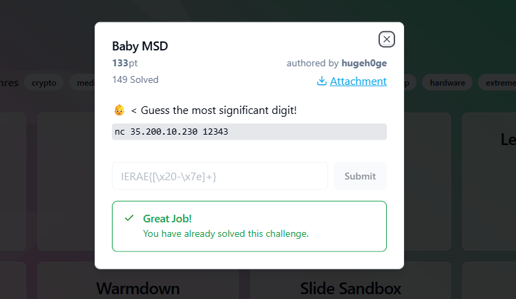

## BABY MSD - IERAE-CTF 2025 Write-up



**Challenge:** Baby MSD
**Category:** Crypto
**Points:** 133
**Author:** MinousE3

### Introduction
This write-up covers the “Baby MSD” challenge from IERAE-CTF 2025. We were given a Python file [`chal.py`](assets/files/chal.py) and a netcat endpoint `nc 35.200.10.230 12343` to interact with the challenge remotely. The script repeatedly generates large random numbers and asks the player to input a modulus value `M`, then tracks the most significant digit (MSD) of `secret % M` across 2000 iterations per stage. The goal is to identify which digit (1–9) appears most frequently as the MSD. This process is repeated over 100 stages, and one wrong guess results in failure. Due to the scale and randomness involved, it was clear that solving this manually was impractical, making automation necessary to reliably pass each stage and ultimately retrieve the flag.

### Analyzing the [`chal.py`](assets/files/chal.py) File
Now, let’s examine [`chal.py`](assets/files/chal.py), the core of the “Baby MSD” challenge:

```bash
#!/usr/bin/env python3

from sys import exit
from random import randint

def stage():
  digit_counts = [0 for i in range(10)]

  for i in range(2000):
    secret = randint(10 ** 60, 10 ** 100)
    M = int(input("Enter mod: "))
    if M < 10 ** 30:
      print("Too small!")
      exit(1)

    msd = str(secret % M)[0]
    digit_counts[int(msd)] += 1

  choice = int(input("Which number (1~9) appeared the most? : "))
  for i in range(10):
    if digit_counts[choice] < digit_counts[i]:
      print("Failed :(")
      exit(1)

  print("OK")

def main():
  for i in range(100):
    print("==== Stage {} ====\n".format(i+1))
    stage()

  print("You did it!")
  with open("flag.txt", "r") as f:
    print(f.read())

if __name__ == '__main__':
  main()
```

The key observation in this code is that the `secret` value is regenerated on every single iteration within a stage—meaning 2000 different large random numbers are generated per stage. Each time, the script asks for a modulus value `M`, computes `secret % M`, and extracts the most significant digit (MSD) of the result. Since `secret` changes every time, and if `M` is kept constant and sufficiently large (e.g., `10**50`), the outputs of `secret % M` tend to be randomly and uniformly distributed across a broad range. As a result, the MSDs approximate a natural distribution, allowing patterns—like '1' being more frequent—to emerge over many iterations. By automating the process of sending a fixed `M` 2000 times and tallying the MSDs, it becomes possible to accurately determine the most common digit and pass each stage reliably.

### Method
In this challenge, the [`chal.py`](assets/files/chal.py) script generates a new random `secret` number for each of the 2000 iterations within a stage. The player must submit a modulus `M` value on each iteration, and the server calculates `secret % M`, extracting the most significant digit (MSD) of the result. After 2000 iterations, the player is asked to guess which digit (from 1 to 9) appeared most frequently as the MSD. If the guess is wrong, the challenge ends.

Since the `secret` is different for every iteration, the MSD distribution can be influenced by controlling the input `M`. A clever strategy for this scenario is to fix `M` to a very specific value: a long string of 1s (e.g., `1111111111111111111111111111111`). This choice of `M` is not random—it’s intentional. The idea is that when `secret` is a large random number and we compute `secret % M` with `M` being a number like `111...111`, the resulting remainder often starts with the digit '1'. This is due to how modular reduction behaves over large uniformly distributed inputs, where the structure of the modulus can bias the distribution of the output.

Instead of trying to simulate or calculate the distribution dynamically, we hardcode `M = 111...111` for all 2000 iterations in a stage. As a result, the MSD of `secret % M` skews heavily toward `1`, making it statistically safe to always guess `'1'` as the most frequent digit. We repeat this process across all 100 stages.

My script, [`babysolve.py`](assets/files/babysolve.py), automates this process by:
1. Connecting to the remote server using `pwntools`.
2. Waiting for the `Enter mod:` prompt and sending `111...111` (with at least 31 digits to satisfy `M >= 10^30`) 2000 times.
3. Responding with `'1'` to the most frequent MSD question.
4. Repeating this over all 100 stages and extracting the final flag.

```bash
from pwn import *
import time
import re

context.log_level = 'info'

def play_once():
    r = remote("35.200.10.230", 12343)
    r.timeout = 30
    try:
        for stage in range(100):
            r.recvuntil(b"====", timeout=10)
            log.info(f"Stage {stage + 1}")

            # Send 2000 times the all-1s modulus to bias MSD toward '1'
            r.recvuntil(b"Enter mod:", timeout=10)
            all_ones_mod = b"1111111111111111111111111111111\n"
            r.send(all_ones_mod * 2000)

            # Respond to the question about which digit appeared the most
            r.recvuntil(b"appeared the most?", timeout=30)
            r.sendline(b"1")

            result = r.recvline(timeout=10)
            if b"Failed" in result:
                log.warning(f"Failed at stage {stage + 1}")
                return False
            elif b"OK" in result:
                log.success(f"Stage {stage + 1} passed!")
            else:
                log.warning(f"Unexpected response: {result}")
                return False

        # Final flag retrieval
        flag_data = r.recvall(timeout=10)
        if flag_data:
            flag_text = flag_data.decode('utf-8', errors='ignore')
            match = re.search(r'[A-Za-z0-9_]+\{[^}]+\}', flag_text)
            if match:
                print(f"\n🎉 FLAG FOUND: {match.group()} 🎉\n")
            else:
                print(f"\n🎉 FLAG DATA: {flag_text.strip()} 🎉\n")
        else:
            log.warning("No flag data received after final stage")
        return True

    except Exception as e:
        log.error(f"Error: {e}")
        return False
    finally:
        r.close()

def main():
    log.info("Starting Baby MSD Solver using all-1s modulus")
    for attempt in range(1, 51):
        log.info(f"Attempt #{attempt}")
        if play_once():
            log.success("Challenge completed successfully!")
            break
        else:
            log.warning("Retrying in 2 seconds...")
            time.sleep(2)
    else:
        log.error("Max attempts reached without success.")

if __name__ == "__main__":
    main()
```

This strategy avoids the complexity of sampling or statistical analysis by exploiting a deterministic bias introduced through the choice of `M`. Despite the randomness of `secret`, the uniformity of the modulus input ensures predictable behavior, making automation both feasible and effective.

After running the script, it consistently solves each stage and successfully retrieves the flag.

```bash
minouse3@DESKTOP:~$ python3 babysolve.py
[*] Starting Baby MSD Solver using all-1s modulus
[*] Attempt #1
[+] Opening connection to 35.200.10.230 on port 12343: Done
[*] Stage 1
[+] Stage 1 passed!
[*] Stage 2
[+] Stage 2 passed!
[*] Stage 3
[+] Stage 3 passed!
[*] Stage 4
[+] Stage 4 passed!
[*] Stage 5
[+] Stage 5 passed!
...
[*] Stage 95
[+] Stage 95 passed!
[*] Stage 96
[+] Stage 96 passed!
[*] Stage 97
[+] Stage 97 passed!
[*] Stage 98
[+] Stage 98 passed!
[*] Stage 99
[+] Stage 99 passed!
[*] Stage 100
[+] Stage 100 passed!
[+] Receiving all data: Done (50B)
[*] Closed connection to 35.200.10.230 port 12343

🎉 FLAG FOUND: IERAE{bab00_gu0ooo_g00_47879e28a162} 🎉

[+] Challenge completed successfully!
```

```bash
flag: IERAE{bab00_gu0ooo_g00_47879e28a162}
```
