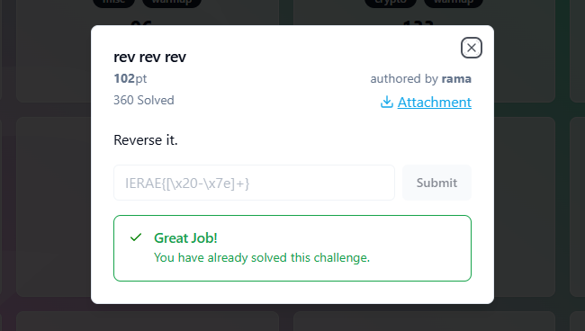

## REV REV REV - IERAE-CTF 2025 Write-up



**Challenge:** rev rev rev
**Category:** Reverse
**Points:** 102
**Author:** MinousE3

### Introduction
For this challenge, “rev rev rev,” we were given two files: a Python source file [`chal.py`](assets/files/chal.py) and an output file [`output.txt`](assets/files/output.txt). The objective was to determine the original flag that, when processed by the script, would generate the given output. 
```bash
[-246, -131, -204, -199, -159, -203, -201, -207, -199, -159, -204, -158, -155, -205, -211, -206, -201, -206, -205, -211, -158, -159, -207, -202, -211, -199, -206, -155, -206, -211, -204, -200, -200, -200, -203, -208, -159, -199, -133, -187, -191, -174, -187, -183]
```
Upon examining the Python code, it was evident that the flag undergoes a sequence of transformations—first reversed, then each character XORed with 0xff, and finally bitwise negated. This series of operations hinted that the challenge name “rev rev rev” was a clue: not only is the list reversed, but the logic itself must be reversed to retrieve the original flag. Manual reversal was impractical due to the nontrivial transformations, so a scripted approach was clearly the way to go.

### Analyzing the [`chal.py`](./assets/files/chal.py) File
Let’s take a look at chal.py, the provided source code for the “rev rev rev” challenge:
```bash
flag = open('flag.txt', 'r').read()
x = [ord(c) for c in flag]
x.reverse()
y = [i^0xff for i in x]
z = [~i for i in y]
open('output.txt', 'w').write(str(z))
```
In [`chal.py`](assets/files/chal.py), the flag is first read from a file and converted to a list of ASCII values using `ord()`. Then, the entire list is reversed. After that, each element is XORed with `0xff`, effectively flipping all its bits. Lastly, a bitwise NOT `~` is applied to each value, and the result is saved into [`output.txt`](assets/files/output.txt). The file we were given [`output.txt`](assets/files/output.txt) contains the final list `z`.

To recover the original flag, we need to reverse these operations step-by-step in the exact opposite order. Starting with `z`, we apply another bitwise NOT to undo the last transformation, then XOR each value with `0xff` to revert the second step. Next, we reverse the list to restore the original order, and finally convert each integer back into a character using `chr()`. This layered obfuscation is likely what inspired the challenge name “rev rev rev,” since reversing is at the core of solving it—both literally and algorithmically.
### Method
The `rev rev rev` challenge centers on a series of data transformations applied to the original flag before writing the result to [`output.txt`](assets/files/output.txt). The [`chal.py`](assets/files/chal.py) script applies three key operations: reversing the character list, XORing each byte with `0xff`, and finally applying a bitwise NOT. To recover the original flag, each of these operations must be inverted carefully and in the correct order.

The final list written to [`output.txt`](assets/files/output.txt) contains the result of applying `~(i ^ 0xff)` to each character in the reversed flag. Therefore, to undo this process, we need to reverse each step as follows:

1. We begin by applying the bitwise NOT operation again, since `~x` flips all bits and returns `-x - 1`, and applying `~` twice restores the original value.
2. Next, we XOR each result with `0xff`, taking advantage of the fact that XOR is its own inverse, so `i ^ 0xff ^ 0xff` returns the original number.
3. Then, we reverse the list to undo the order change applied earlier in the script.
4. Finally, we convert each number back into a character using `chr()`, effectively undoing the initial conversion from characters to ASCII with `ord()`.

By following this process, we arrive at the script below, [`revsolve.py`](./assets/files/revsolve.py), which reverses the transformation steps and reveals the original flag:

```bash
with open("output.txt", "r") as f:
    z = eval(f.read())  # Load the mangled list

y = [~i for i in z]            # Step 1: Undo bitwise NOT
x = [i ^ 0xff for i in y]      # Step 2: Undo XOR with 0xff
x.reverse()                    # Step 3: Undo the list reversal
flag = ''.join(chr(i) for i in x)  # Step 4: ASCII to character

print("Recovered flag:", flag)
```

Running this script will output the original flag to the terminal, successfully solving the challenge.

```bash
minouse3@DESKTOP:~/revrevrev$ python3 revsolve.py
Recovered flag: IERAE{9a058884-2e29-61ab-3272-3eb4a9175a94}
```

```bash
flag: IERAE{9a058884-2e29-61ab-3272-3eb4a9175a94}
```