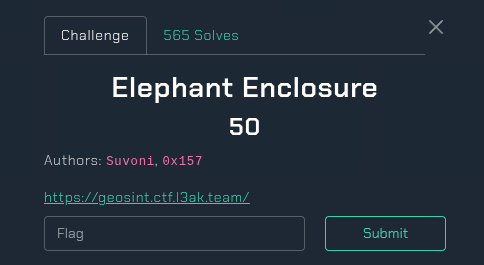
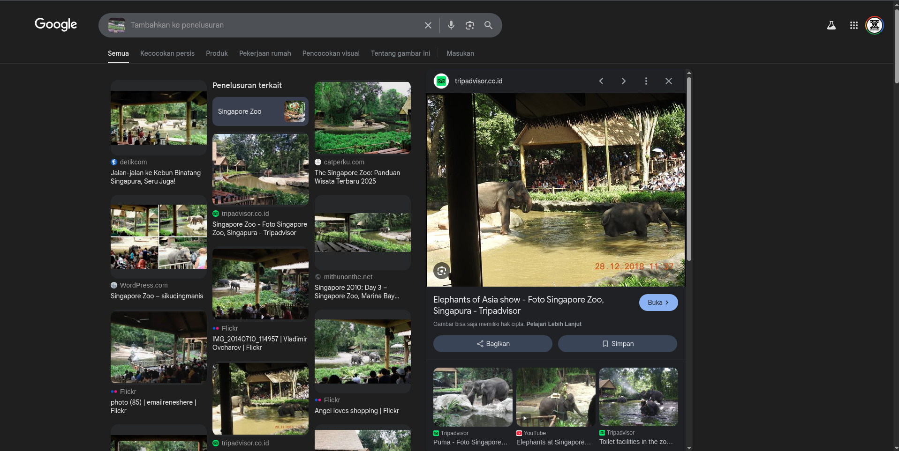
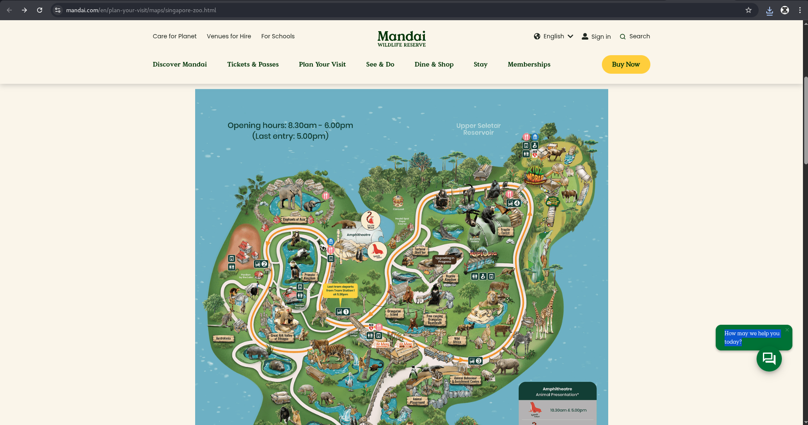
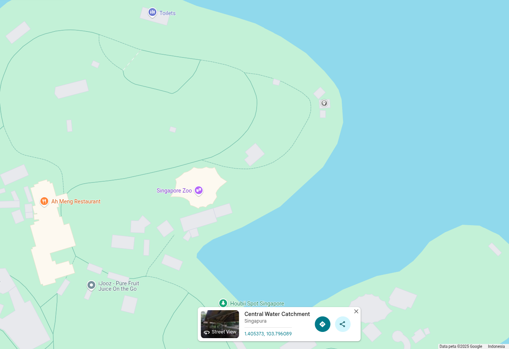
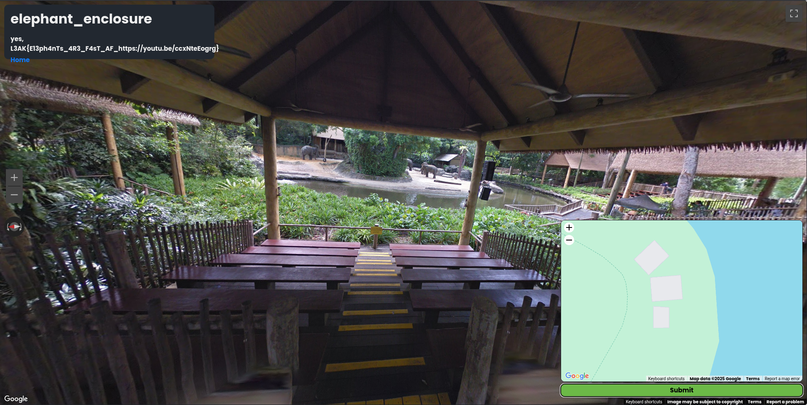

## Elephant Enclosure - L3akCTF 2025 Write-up



**Challenge:** Elephant Enclosure
**Category:** OSINT
**Points:** 50
**Author:** MinousE3

### Introduction
The Elephant Enclosure challenge is one of eight GeoGuessr-style OSINT challenges hosted at `https://geosint.ctf.l3ak.team/`. Players are presented with an embedded Street View scene and are tasked with identifying the precise real-world location. Once a user selects a point on the map and submits it, the platform returns a yes/no response, and a flag if correct. The challenges vary in difficulty and require attention to detail, reverse image searching, and geolocation skills.


### Analyzing the Given Data
Upon entering the scene at `https://geosint.ctf.l3ak.team/L3akCTF-elephant_enclosure`, we are greeted by a tropical setting with lush greenery and a wooden boardwalk. Prominent features include:

* A thatched-roof pavilion used as a shaded viewing platform.
* Signs in English, including “Exit” and accessibility indicators.
* A large elephant enclosure surrounded by water, complete with viewing areas and benches.
* A blue recycling bin with cartoon drawings, often found in Southeast Asian zoos.
* The general cleanliness and design suggest a modern, high-budget zoo, likely in a well-developed country with tropical climate.

### Method
One thing that immediately caught my attention in the Street View scene (elephant_enclosure) was, quite obviously — the elephant. Given how specific that detail was, I decided to take a screenshot of the elephant and the viewing platform, and run a reverse image search using Google Lens.


This proved to be a great lead: several similar images popped up, consistently pointing to the Elephants of Asia exhibit in Singapore Zoo. The architecture, fencing, and tropical environment in the Street View matched closely with photos of this exhibit found online.



However, knowing the zoo wasn’t enough — the challenge required us to pinpoint the exact camera location from which the Street View was captured. To do this, we searched for the Singapore Zoo map and identified that the Elephants of Asia area is located on the left side of the Upper Seletar Reservoir. 



Using Google Maps, we navigated to that area and eventually spotted a distinctive three-square-shaped building, which had available Street View coverage.



Upon entering that Street View spot, the scene matched exactly with the one given in the challenge — same fence, same elephant, same angle. 


With full confidence, we returned to the challenge interface and clicked the matching location on the mini-map.



Sure enough, this revealed the correct flag:
```bash
L3AK{E13ph4nTs_4R3_F4sT_AF_https://youtu.be/ccxNteEogrg}
```
