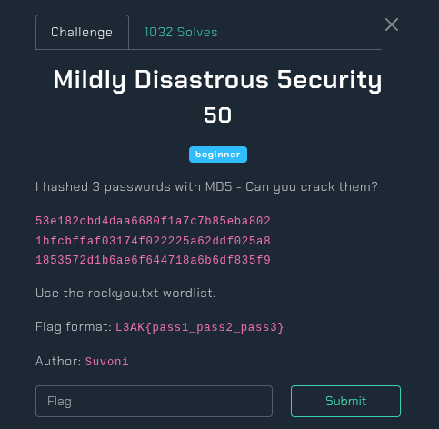

## Mildly Disastrous 5ecurity - L3akCTF 2025 Write-up



**Challenge:** Mildly Disastrous 5ecurity
**Category:** Hash Cracking
**Points:** 50
**Author:** MinousE3

### Introduction
This beginner-level challenge titled “Mildly Disastrous 5ecurity” tasks us with cracking three MD5 hashes derived from unknown passwords. The use of MD5, a weak and outdated hashing algorithm, makes the challenge relatively straightforward — especially with the help of a well-known wordlist like `rockyou.txt`. Once cracked, the three plaintext passwords must be inserted into the flag in the format `L3AK{pass1_pass2_pass3}`.

### Analyzing the Given Data
Instead of providing any files, the challenge description gives us three MD5 hashes directly:

```bash
53e182cbd4daa6680f1a7c7b85eba802
1bfcbffaf03174f022225a62ddf025a8
1853572d1b6ae6f644718a6b6df835f9
```
We are told that all three of these hashes were generated using the MD5 algorithm, and that they correspond to three passwords in the `rockyou.txt` wordlist — a popular dictionary used in password cracking and CTFs.

To make the cracking process easier, I first saved the hashes in a text file called [`hash.txt`](assets/files/hash.txt).

### Method
For this challenge, I chose to use hashcat — a powerful GPU-accelerated password recovery tool — to perform a dictionary attack against the given MD5 hashes using the `rockyou.txt` wordlist.

Since these are simple MD5 hashes, I used the hash mode 0 which tells hashcat to treat them as raw MD5. Here's the exact command I ran:
```bash
hashcat -m 0 -a 0 -o output.txt hash.txt rockyou.txt
```
After running the command, Hashcat successfully cracked all three hashes. The found.txt file contained the following:
```bash
┌──(minouse3㉿kali)-[~]
└─$ cat output.txt
53e182cbd4daa6680f1a7c7b85eba802:cookiezz
1853572d1b6ae6f644718a6b6df835f9:sauron82
1bfcbffaf03174f022225a62ddf025a8:m00nl!ght
```
Now that we have the three plaintexts:
* cookiezz
* m00nl!ght
* sauron82

We can format them into the flag as instructed.

```bash
L3AK{cookiezz_m00nl!ght_sauron82}
```
