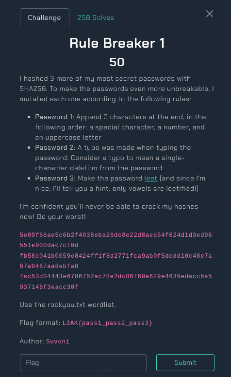

## Rule Breaker 1 - L3akCTF 2025 Write-up



**Challenge:** Rule Breaker 1
**Category:** Hash Cracking
**Points:** 50
**Author:** MinousE3

### Introduction
In the Rule Breaker 1 challenge from L3akCTF 2025, we are given 3 SHA256 hashes. Each hash corresponds to a password that has been mutated using a specific rule. We are also given the rules used to mutate the passwords and instructed to use the popular `rockyou.txt` wordlist for cracking. The goal is to recover the original passwords and submit the final flag in the format `L3AK{pass1_pass2_pass3}`.

### Hashes and Rules
We are provided with the following SHA256 hashes:

```bash
5e09f66ae5c6b2f4038eba26dc8e22d8aeb54f624d1d3ed96551e900dac7cf0d
fb58c041b0059e8424ff1f8d2771fca9ab0f5dcdd10c48e7a67a9467aa8ebfa8 
4ac53d04443e6786752ac78e2dc86f60a629e4639edacc6a5937146f3eacc30f
```

Each hash corresponds to a mutation rule:

* *Password 1*: Append 3 characters in this order — a special character, a digit, and an uppercase letter.
* *Password 2*: Has a single-character deletion (typo).
* *Password 3*: Leetified version of the password where only vowels are replaced (`a → @`, `e → 3`, `i → 1`, `o → 0`).

### How to solve it?
I created a Python script [`rb1-solve`](assets/files/rb1-solve.py) to automate the cracking process. It reads the hashes from [`hash.txt`](assets/files/hash.txt), uses `rockyou.txt` as the wordlist, and applies all three mutation rules accordingly.

Here is the full solution script:

```bash
import hashlib
import itertools
import sys

# Load SHA256 hashes from hashes256.txt
try:
    with open("hash.txt", "r") as f:
        lines = [line.strip() for line in f.readlines()]
        if len(lines) < 3:
            print("Error: hashes256.txt must contain at least 3 hashes (one per line)")
            sys.exit(1)
        target_hashes = {
            "pass1": lines[0],
            "pass2": lines[1],
            "pass3": lines[2],
        }
except FileNotFoundError:
    print("Error: hashes256.txt not found")
    sys.exit(1)

found = {}

# Mutation 1: Append special + digit + uppercase
def try_mutation_1(word):
    specials = "!@#$%^&*"
    digits = "0123456789"
    uppers = "ABCDEFGHIJKLMNOPQRSTUVWXYZ"
    for c1, c2, c3 in itertools.product(specials, digits, uppers):
        mutated = word + c1 + c2 + c3
        h = hashlib.sha256(mutated.encode()).hexdigest()
        if h == target_hashes["pass1"]:
            return mutated
    return None

# Mutation 2: Remove one character
def try_mutation_2(word):
    if len(word) <= 1:
        return None
    for i in range(len(word)):
        mutated = word[:i] + word[i+1:]
        h = hashlib.sha256(mutated.encode()).hexdigest()
        if h == target_hashes["pass2"]:
            return mutated
    return None

# Mutation 3: Leetify vowels only
def try_mutation_3(word):
    leet_map = str.maketrans("aeio", "@310")
    mutated = word.translate(leet_map)
    h = hashlib.sha256(mutated.encode()).hexdigest()
    if h == target_hashes["pass3"]:
        return mutated
    return None

# Main cracking loop
try:
    with open("/usr/share/wordlists/rockyou.txt", "r", errors="ignore") as f:
        for line in f:
            word = line.strip()

            # Skip if all found
            if len(found) == 3:
                break

            # Try pass1
            if "pass1" not in found:
                m1 = try_mutation_1(word)
                if m1:
                    print(f"[+] Found pass1: {m1}")
                    found["pass1"] = m1

            # Try pass2
            if "pass2" not in found:
                m2 = try_mutation_2(word)
                if m2:
                    print(f"[+] Found pass2: {m2}")
                    found["pass2"] = m2

            # Try pass3
            if "pass3" not in found:
                m3 = try_mutation_3(word)
                if m3:
                    print(f"[+] Found pass3: {m3}")
                    found["pass3"] = m3

    # Output final flag
    if len(found) == 3:
        flag = f"L3AK{{{found['pass1']}_{found['pass2']}_{found['pass3']}}}"
        print(f"\n🎉 Flag: {flag}")
    else:
        print("\n⚠️ Some passwords were not found.")
except FileNotFoundError:
    print("Error: rockyou.txt not found. Please make sure it's in the same directory.")
```

To crack each password, we implemented three mutation strategies based on the rules. For password 1, we appended a special character, a digit, and an uppercase letter to each word in the wordlist, generating all 2080 combinations per word using a Cartesian product and comparing each SHA256 hash. For password 2, we simulated a typo by removing one character at a time from each word and checking whether the mutated version matched the target hash. For password 3, we applied a leetspeak transformation where vowels were replaced (`a → @`, `e → 3`, `i → 1`, `o → 0`) and then checked the resulting hash. The script reads words from rockyou.txt, applies each mutation, and records a match if any mutated word’s hash matches the target. Once all three passwords were found, they were combined into the flag format: `L3AK{pass1_pass2_pass3}`.

After running the solution script, we successfully recovered all three mutated passwords:

```bash
┌──(minouse3㉿kali)-[~/…/L3akCTF 2025/Rule Breaker 1/assets/files]
└─$ python3 rb1-solve.py
[+] Found pass3: unf0rg1v@bl3
[+] Found pass2: thecowsaysmo
[+] Found pass1: hyepsi^4B

🎉 Flag: L3AK{hyepsi^4B_thecowsaysmo_unf0rg1v@bl3}
```
Thus, the final flag is:

```bash
L3AK{hyepsi^4B_thecowsaysmo_unf0rg1v@bl3}
```
