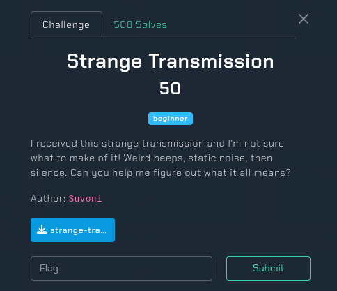
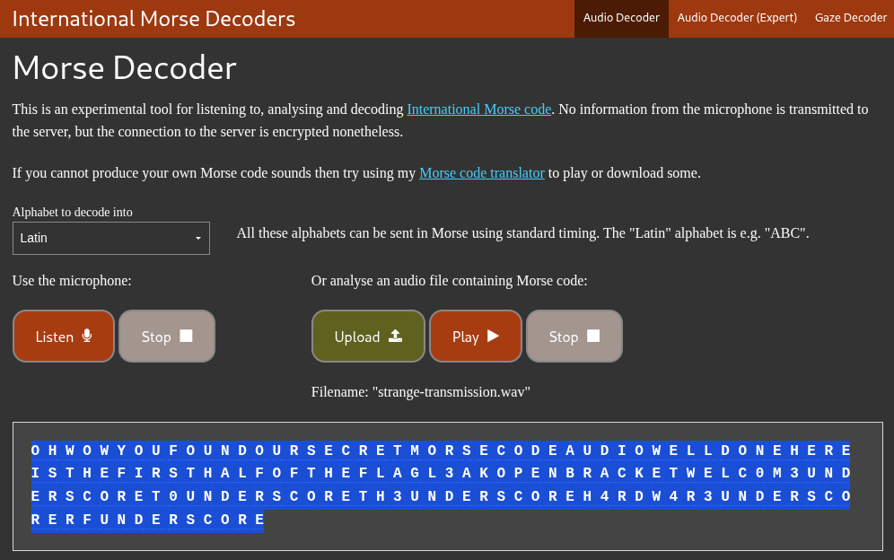
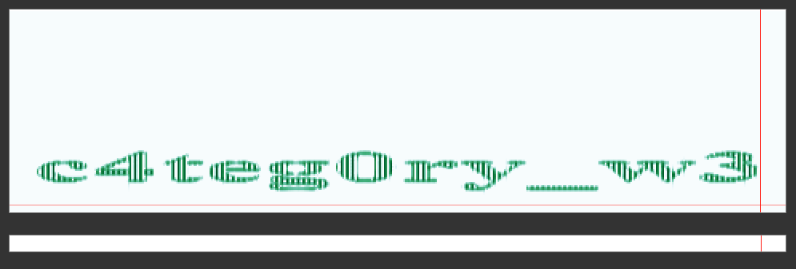
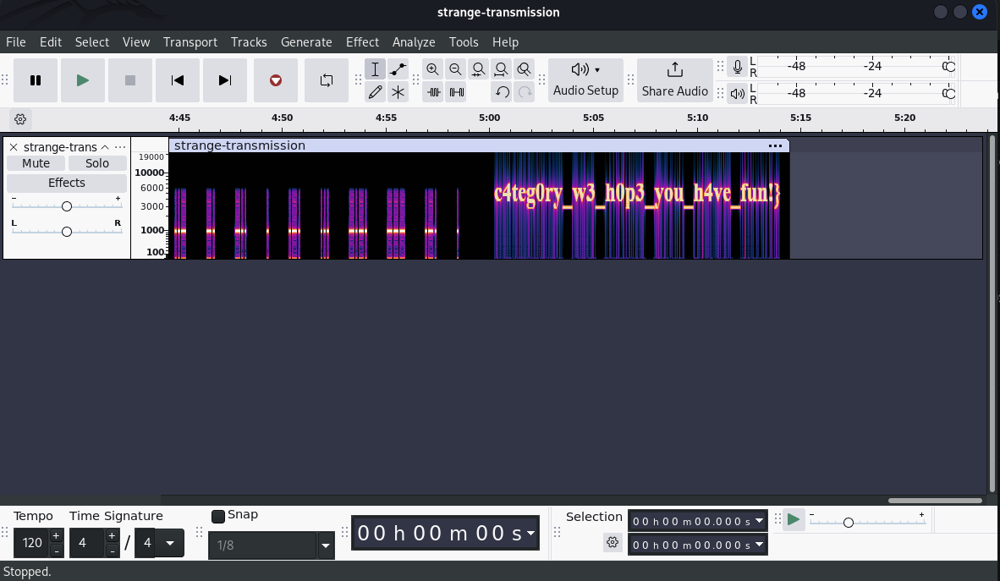

## Strange Transmission - L3akCTF 2025 Write-up



**Challenge:** Strange Transmission
**Category:** Hardware-RF
**Points:** 50
**Author:** MinousE3

### Introduction
In this challenge, we were given an audio file named [`strange-transmission.wav`](assets/files/strange-transmission.wav) containing strange beeps and static noise. The goal was to analyze the signal and extract any hidden information that might lead to the flag. Since this is categorized under Hardware-RF, we anticipated that the transmission could involve digital modulation or audio encoding techniques commonly used in radio or signal analysis contexts.

### Breaking Down the Transmission
Upon listening to the [`strange-transmission.wav`](assets/files/strange-transmission.wav) file, it became clear that the majority of the audio consists of repeated beeping sounds. These beeps vary in length and spacing, which strongly suggests the use of Morse code. The beeping pattern continues consistently for most of the audio duration, indicating a potentially encoded message.

Near the end of the transmission, however, there is a noticeable shift — a short burst of strange, distorted noise that sounds somewhat "alien" or synthetic. This could be a form of frequency shift, digital data, or another embedded layer of information. But given the structure and clarity of the earlier beeps, the primary focus is most likely the Morse-coded message.

### Decoding the Transmission
Recognizing that the majority of the transmission consisted of rhythmic beeping sounds, I suspected Morse code and used an online adaptive decoder tool: [https://morsecode.world/international/decoder/audio-decoder-adaptive.html](https://morsecode.world/international/decoder/audio-decoder-adaptive.html). After feeding the audio into the decoder, it successfully extracted the message:



```bash
OH WOW YOU FOUND OUR SECRET MORSE CODE AUDIO WELL DONE HERE IS THE FIRST HALF OF THE FLAG L3AK{WELC0M3_T0_TH3_H4RDW4R3_RF_
```

This revealed the first half of the flag. However, I noticed a peculiar pattern near the end of the audio when viewing the waveform chart provided by the challenge site—suggesting a visual message might be encoded in the frequency spectrum. 



To analyze this, I loaded the audio into *Audacity*, switched to *Spectrogram view*, and zoomed into the final portion. 



There, a clear text string was revealed in the spectrogram:

```bash
c4teg0ry_w3_h0p3_you_h4ve_fun!}
```

Combining both parts, the complete flag is:

```bash
L3AK{WELC0M3_T0_TH3_H4RDW4R3_RF_c4teg0ry_w3_h0p3_you_h4ve_fun!}
```
