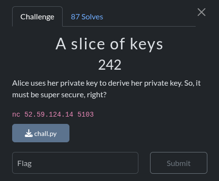

## A slice of keys - Nullcon HackIM CTF Berlin 2025 Write-up



**Challenge:** A slice of keys
**Category:** Cryptography
**Points:** 242
**Author:** minouse3

### Introduction
A slice of keys is one of those crypto problems where the title basically spoils the trick—in a good way. The server slices bits out of the RSA private exponent d and reuses that slice as an AES key. You connect to nc 52.59.124.14 5103, it prints an AES-ECB ciphertext of the padded flag, and then it lets you play with up to 128 RSA encrypt/decrypt queries. The moment I saw e = 1337 and a deterministic function of d feeding AES, I figured I wouldn’t need to factor anything; I’d just need to recover n and approximate the top of d well enough to recreate the exact slice.

### Analyzing the [`chall.py`](assets/files/chall.py) File
The giveaway is in the source. After generating a 2048-bit RSA key, the server converts d to bits, takes the first 258 of them, and then keeps every second bit starting at index 2—so you end up with 128 bits for an AES-128 key. That’s a fixed, deterministic view of the high end of d. Since for big moduli we have φ(n) ≈ n, and because e·d − k·φ(n) = 1 for a tiny k < e, the high bits of d line up with ⌊k·n/e⌋. In other words, if I can recover n and iterate small k, I can mimic the server’s slice and try those as AES keys. The only mildly annoying part is the off-by-one risk from rounding, so I also try a couple of one-bit “alignment” tweaks when slicing.
```py
from Crypto.PublicKey import RSA
from Crypto.Cipher import AES

flag = open('flag.txt','r').read().strip().encode()
pad = (16 - len(flag)) % 16
flag = flag + pad * int(16).to_bytes()

key = RSA.generate(2048, e = 1337)
n = key.n
e = key.e
d = key.d

AES_key = int(bin(d)[2:258:2],2).to_bytes(16)
crypter = AES.new(AES_key, AES.MODE_ECB)
cipher = crypter.encrypt(flag)
print(cipher.hex())

for _ in range(128):
	user_input = input('(e)ncrypt|(d)ecrypt:<number>\n')
	option,m = user_input.split(':')
	m = int(m)
	if option == 'e':
		print(pow(m,e,n))
	elif option == 'd':
		print(pow(m,d,n))
	else:
		print('wrong option')
```

### How I got the flag
I started by grabbing the ciphertext that the service prints right away. Then I avoided the decryption oracle completely and used only encryption to recover n. Because RSA is multiplicative, Enc(xy) ≡ Enc(x)·Enc(y) (mod n), so the value Enc(x)·Enc(y) − Enc(xy) is a multiple of n. If you take the gcd of that expression across a couple dozen random pairs (x, y), it collapses to the 2048-bit modulus. With n in hand, I scanned k = 1..e−1 and formed approx_d = ⌊k·n/e⌋, then reproduced the server’s exact slice on the high 258 bits—plus a couple of one-bit pad/shift variants just to cover rounding noise—and tried each candidate as an AES key against the captured ciphertext. One of them immediately decrypted to clean ASCII with the flag. Here’s the solver I used:

```py
from pwn import remote
from Crypto.Cipher import AES
import math, random, re

HOST, PORT = "52.59.124.14", 5103
E = 1337
PROMPT_PREFIX = b"(e)ncrypt|(d)ecrypt:"

FLAG_RE = re.compile(r"ENO\{[ -~]{0,120}\}")  # printable up to 120 chars inside

def recv_until_hex(io) -> str:
    while True:
        line = io.recvline().strip()
        if line and not line.startswith(PROMPT_PREFIX):
            t = line.decode(errors="ignore")
            if len(t) % 2 == 0 and len(t) >= 32:
                try:
                    bytes.fromhex(t)
                    return t
                except Exception:
                    pass

def recv_next_int(io) -> int:
    while True:
        line = io.recvline().strip()
        if not line or line.startswith(PROMPT_PREFIX):
            continue
        try:
            return int(line)
        except ValueError:
            continue

def enc(io, m: int) -> int:
    io.sendline(f"e:{m}".encode())
    return recv_next_int(io)

def recover_n(io, pairs=24) -> int:
    g = 0
    for _ in range(pairs):
        x = random.getrandbits(256) | 1
        y = random.getrandbits(256) | 1
        cx = enc(io, x)
        cy = enc(io, y)
        cxy = enc(io, x * y)
        t = abs(cx * cy - cxy)
        g = t if g == 0 else math.gcd(g, t)
    while g % 2 == 0:
        g //= 2
    if g.bit_length() < 2040 or g.bit_length() > 2060:
        for _ in range(8):
            x = random.getrandbits(256) | 1
            y = random.getrandbits(256) | 1
            g = math.gcd(g, abs(enc(io, x) * enc(io, y) - enc(io, x * y)))
        while g % 2 == 0:
            g //= 2
    return g

def key_exact_slice_from_bits(bits: str) -> bytes:
    """
    Reproduce: int(bin(d)[2:258:2], 2).to_bytes(16, 'big')
    - 'bits' is bin(d)[2:] (MSB..LSB)
    - Left-pad with zeros to ensure we have at least 258 bits
    - Take slice [2:258:2] → positions 2,4,6,...,256 (128 bits)
    """
    if len(bits) < 258:
        bits = "0" * (258 - len(bits)) + bits
    window = bits[:258]
    sliced = window[2:258:2]
    return int(sliced, 2).to_bytes(16, "big")

def alignment_keys(approx_d: int):
    """
    Try multiple alignments of the MSB bitstring before applying the exact slice:
      A) bits
      B) '0' + bits   (pretend an extra leading 0)
      C) '00' + bits  (two leading zeros)
      D) bits[1:]     (drop one leading bit)
      E) bits[2:]     (drop two leading bits)
    """
    b = bin(approx_d)[2:]
    tried = set()
    candidates = [b, "0"+b, "00"+b]
    if len(b) > 1: candidates.append(b[1:])
    if len(b) > 2: candidates.append(b[2:])
    for s in candidates:
        k = key_exact_slice_from_bits(s)
        if k not in tried:
            tried.add(k)
            yield k

def try_decrypt(cipher_hex: str, n: int):
    ct = bytes.fromhex(cipher_hex)
    for t in range(1, E):  # t is the k from e*d - t*phi(n) = 1
        approx_d = (t * n) // E
        for key in alignment_keys(approx_d):
            pt = AES.new(key, AES.MODE_ECB).decrypt(ct)
            # accept immediately if ENO{...} appears anywhere
            m = FLAG_RE.search(pt.decode("utf-8", errors="ignore"))
            if m:
                print(f"[+] FOUND with t={t}, key={key.hex()}")
                print(m.group(0))
                return
    print("[-] Still no match. Try increasing pairs or print top candidates again.")

def main():
    io = remote(HOST, PORT)
    cipher_hex = recv_until_hex(io)
    print(f"[+] Got ciphertext ({len(cipher_hex)//2} bytes)")
    n = recover_n(io, pairs=24)  # 72 encrypts, well under 128
    print(f"[+] Recovered n (bits={n.bit_length()})")
    try_decrypt(cipher_hex, n)
    io.close()

if __name__ == "__main__":
    main()
```

And here’s the run that sealed it. It lands on k = 127, reconstructs the AES key, and the plaintext includes the flag:
```bash
┌──(minouse3㉿kali)-[~] 
└─$ python3 solver.py 
[+] Opening connection to 52.59.124.14 on port 5103: Done 
[+] Got ciphertext (64 bytes) [+] Recovered n (bits=2048) 
[+] FOUND with t=127, key=b16508ca5be75ae3de223cf9b9c5f170 
ENO{you_kow_at_least_some_bits_of_the_private_exponent} 
[*] Closed connection to 52.59.124.14 port 5103
```

### Flag
```
ENO{you_kow_at_least_some_bits_of_the_private_exponent}
```