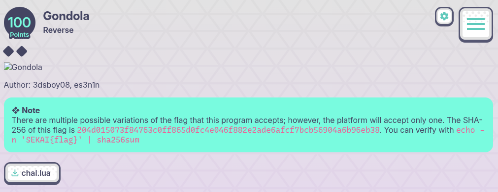
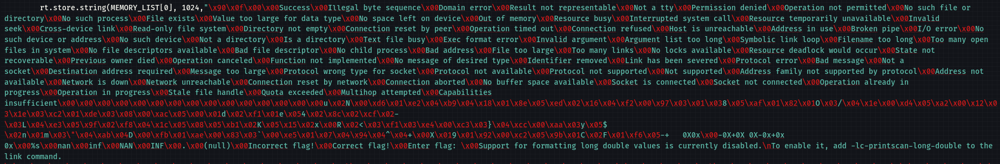

## Gondola - SekaiCTF 2025 Write-up



**Challenge:** Gondola
**Category:** Reverse
**Points:** 100
**Author:** minouse3

### Introduction
This was the first time I encountered a `.lua` file in a CTF challenge—especially in the Reverse Engineering category. The challenge came as a single script, [**chal**](assets/files/chal.lua), which turned out to be a complete LuaJIT-based setup. It bundled a tiny WebAssembly (WASM) binary along with a minimal WASI shim, all packed into one Lua file.

My goal was to understand what the script was checking for and extract the flag it accepted. Interestingly, the checker allowed several variations of the flag, but the scoreboard only recognized one specific version.

To verify the correct variant locally, the expected SHA-256 hash is:
```
204d015073f84763c0ff865d0fc4e046f882e2ade6afcf7bcb56904a6b96eb38
```

A candidate flag can be checked using:
```sh
echo -n 'SEKAI{flag}' | sha256sum
```

### Analyzing the [**chal.lua**](assets/files/chal.lua) file
First thing I did was run it. It immediately asked for a flag; when I typed junk, it replied “Incorrect flag!”. That exact flow is right there in the code: it prints the prompt from a fixed string address, points another address at the “Incorrect flag!” message, and refuses to continue unless the input is exactly 32 bytes. You can see that in `FUNC_LIST[78]`:
```lua
-- inside FUNC_LIST[78]
reg_0 = FUNC_LIST[75](2775, loc_0)   -- prints "Enter flag:"
loc_2 = 2803                          -- points at "Incorrect flag!"
reg_0 = FUNC_LIST[25](add_i32(loc_0, 16))
if reg_0 == 32 then
    goto continue_at_2                -- exact length gate
end
```

Once the length check passes, the checker pulls a bunch of 64-bit constants straight out of its linear memory. One value at `4384` gets byte-swapped, two values at `4400/4408` are multiplied by `-511`, four more keys are loaded from `4352/4360/4368/4376`, one more from `4392`, and then it sets `loc_14 = 4416` which is the base of an 8×u64 target table:
```lua
loc_4  = load_i64(memory_at_0, 0 + 4384)          -- byteswapped later
loc_6  = (load_i64(memory_at_0, 0 + 4400) * -511LL)
loc_7  = (load_i64(memory_at_0, 0 + 4408) * -511LL)
loc_8  = load_i64(memory_at_0, 0 + 4352)          -- K[0]
loc_9  = bxor_i64(rotl_i64(loc_8, 39LL), loc_8)   -- pre-mix of K[0]
loc_10 = load_i64(memory_at_0, 0 + 4360)          -- K[1]
loc_11 = load_i64(memory_at_0, 0 + 4368)          -- K[2]
loc_12 = load_i64(memory_at_0, 0 + 4376)          -- K[3]
loc_13 = load_i64(memory_at_0, 0 + 4392)          -- K[5]
loc_14 = 4416                                      -- base of targets T[0]
```

After that setup, it processes the input four bytes at a time (little-endian `u32`, zero-extended to 64 bits), jumps into one of eight little branchlets (`::continue_at_12::` down to `::continue_at_5::`), runs a rotate/xor/add mixer keyed by those constants, and compares the 64-bit result against `T[i]` at `4416 + 8*i`. If any comparison fails, it prints “Incorrect flag!”; only when all eight comparisons succeed does it print “Correct flag!”. The loop in the file looks like this:
```lua
while true do
    loc_4 = load_i64_u32(memory_at_0, loc_15)   -- read next 4 bytes (u32 -> u64)
    if not br_map[1] then
        br_map[1] = (function() return { [0] = 0, 1, 2, 3, 4, 5, 6, 7, } end)()
    end
    temp = br_map[1][loc_1] or 0
    -- dispatch to ::continue_at_12:: ... ::continue_at_5:: (8 mixers)
    ...
```

One side note: the data segment holds the three user-visible strings in order—"Incorrect flag!\0Correct flag!\0Enter flag:\0"—and then a lot of unrelated WASI/libc strings. If you dump a wide slice of memory there you’ll see extra text like “Support for formatting long double …”. The checker doesn’t use that; it’s just neighbors in memory.



### How to get the flag
I started by instrumenting the program to dump the constants exactly as the checker sees them. I added this tiny block inside `chal.lua`, just after memory initialization and before the validator runs, so it prints the eight 64-bit keys and eight 64-bit targets from their actual addresses and then exits:
```lua
-- add near the bottom, after run_init_code() and memory_at_0 is set
do
  local function u64hex(addr)
    local lo = rt.load.i32(memory_at_0, addr)
    local hi = rt.load.i32(memory_at_0, addr + 4)
    return string.format("0x%08x%08x", hi, lo) -- little-endian
  end
  print("--- KEYS ---")
  for i, addr in ipairs{4352,4360,4368,4376,4384,4392,4400,4408} do
    print(string.format("K[%d]=%s", i-1, u64hex(addr)))
  end
  print("--- TARGETS ---")
  for i=0,7 do
    print(string.format("T[%d]=%s", i, u64hex(4416 + 8*i)))
  end
  print("--- STRINGS ---")
  io.write(rt.load.string(memory_at_0, 2775-32, 160), "\n")
  os.exit(0)
end
```

Running the modified file [**chal_modified.lua**](assets/files/chal_modified.lua) with LuaJIT gave me the exact values the mixer uses:
```sh
┌──(minouse3㉿kali)-[~]
└─$ luajit chal_modified.lua 
--- KEYS ---
K[0]=0x77ab3bd16e690400
K[1]=0x28613e1ba1b33600
K[2]=0x5b80a90427dfd000
K[3]=0x7dd093e0ac127400
K[4]=0xed2c474358207700
K[5]=0xd86cfa00c18d6200
K[6]=0x5ea21a1228076800
K[7]=0xf40d246c32423080
--- TARGETS ---
T[0]=0x291b5ac66a3ae800
T[1]=0xdf1ef268bd407c00
T[2]=0xa9f798551b797800
T[3]=0x91e5b6efce057400
T[4]=0xf565b92f43a07c80
T[5]=0x8e3dc34d4d910800
T[6]=0xb43335bfc0181c00
T[7]=0xd569cc8badd8c400
--- STRINGS ---
\0\0�\0\0�\0\0C\0\0F\0\0�\0\0-\0+\0 \0 \0 \00\0X\00\0x\0\0-\00\0X\0+\00\0X\0 \00\0X\0-\00\0x\0+\00\0x\0 \00\0x\0\0%\0s\0\0n\0a\0n\0\0i\0n\0f\0\0N\0A\0N\0\0I\0N\0F\0\0.\0\0(\0n\0u\0l\0l\0
```

With the constants grounded, I let a solver do the heavy lifting. Each four-byte block is independent, and each branch is a straight composition of modulo-$2^{64}$ adds, xors, and variable rotates, which maps perfectly to bit-vectors. I rebuilt each branch’s transformation as a bit-vector expression, constrained the unknown four bytes to printable ASCII, and solved the equation `f_i(x) == T[i]` for every position. Seven positions had a single printable solution and one position had many, which means the checker will accept a small family of flags. When I enumerated the full set of printable solutions and hashed them, only one variant had a SHA-256 hash matching the note from the challenge description:
```
204d015073f84763c0ff865d0fc4e046f882e2ade6afcf7bcb56904a6b96eb38
```

I used a script named [**gondola_solve.py**](assets/files/gondola_solve.py). It parses the branch code from `chal.lua`, solves all eight blocks with printable constraints, prints the per-block counts and total candidates, highlights the platform-accepted flag by SHA-256, and then enumerates all flags (up to `max_show`, default 10,000). Put it next to `chal.lua` and run it after installing Z3. 
```py
revise a little bit. the solver code is this:

# gondola_all_flags.py — enumerate every printable-ASCII flag accepted by Gondola
# Requires: z3-solver; Place next to "chal (2).lua"

from pathlib import Path
import re, itertools, hashlib
from z3 import *

# === constants you dumped with luajit ===
K = [
    0x77ab3bd16e69044a, 0x28613e1ba1b3368c, 0x5b80a90427dfd027, 0x7dd093e0ac1273c0,
    0xed2c47435820775f, 0xd86cfa00c18d6218, 0x5ea21a12280769d4, 0xf40d246c3242308d
]
T = [
    0x291b5ac66a3ae85c, 0xdf1ef268bd407c90, 0xa9f798551b79797a, 0x91e5b6efce05735a,
    0xf565b92f43a07c75, 0x8e3dc34d4d9107bd, 0xb43335bfc0181b24, 0xd569cc8badd8c4eb
]
TARGET_SHA = "204d015073f84763c0ff865d0fc4e046f882e2ade6afcf7bcb56904a6b96eb38"

# === 64-bit helpers ===
MASK64 = (1 << 64) - 1
def C(v): return BitVecVal(v & MASK64, 64)
def to64(x): return C(x) if isinstance(x, int) else x
def band(a,b): return to64(a) & to64(b)
def bor(a,b):  return to64(a) | to64(b)
def bxor(a,b): return to64(a) ^ to64(b)
def shl(a,n):
    if isinstance(n,int): n &= 63
    else: n = band(n, C(63))
    return (to64(a) << to64(n)) & C(MASK64)
def shr(a,n):
    if isinstance(n,int): n &= 63
    else: n = band(n, C(63))
    return LShR(to64(a), to64(n))
def ashr(a,n):
    if isinstance(n,int): n &= 63
    else: n = band(n, C(63))
    return to64(a) >> to64(n)
def rotl(a,n):
    if isinstance(n,int): n &= 63
    else: n = band(n, C(63))
    return bor((to64(a) << to64(n)) & C(MASK64),
               LShR(to64(a), (C(64) - to64(n)) & C(63)))
def rotr(a,n):
    if isinstance(n,int): n &= 63
    else: n = band(n, C(63))
    return bor(LShR(to64(a), to64(n)),
               (to64(a) << ((C(64) - to64(n)) & C(63))) & C(MASK64))
def byteswap64_const(v):
    v &= MASK64
    b = [(v >> (8*i)) & 0xff for i in range(8)]
    return (b[0]<<56)|(b[1]<<48)|(b[2]<<40)|(b[3]<<32)|(b[4]<<24)|(b[5]<<16)|(b[6]<<8)|b[7]

# === parse FUNC_LIST[78] and slice the case bodies ===
def slice_func78(lua_text: str) -> str:
    i = lua_text.find("FUNC_LIST[78] = function()")
    return lua_text[i: lua_text.find("\nend", i) if i >= 0 else len(lua_text)] if i >= 0 else lua_text

def build_case_from_lua(lua_text: str, label_num: int):
    body = slice_func78(lua_text)
    start = body.find(f"::continue_at_{label_num}::")
    assert start >= 0, f"Label ::continue_at_{label_num}:: not found"
    g = body.find("goto continue_at_4", start)
    l = body.find("::continue_at_4::", start)
    ends = [x for x in (g, l) if x != -1]
    assert ends, "End-of-branch not found"
    block = body[start:min(ends)]
    assigns = []
    for ln in block.splitlines():
        ln = ln.strip()
        if not ln or ln.startswith("::") or ln.startswith("goto"):
            continue
        ln = ln.rstrip(';')
        if '=' in ln:
            assigns.append(ln)
    return assigns

CALL_MAP = {
    'band_i64': 'band', 'bor_i64' : 'bor',  'bxor_i64': 'bxor',
    'shl_i64' : 'shl',  'shr_u64' : 'shr',  'shr_i64' : 'ashr',
    'rotl_i64': 'rotl', 'rotr_i64': 'rotr', 'rol_i64' : 'rotl', 'ror_i64' : 'rotr',
}
NUM_RE = re.compile(r'(?<![A-Za-z0-9_])(-?\d+)LL?')
def lua_expr_to_py(src: str) -> str:
    for k, v in CALL_MAP.items():
        src = src.replace(k, v)
    return NUM_RE.sub(r'C(\1)', src)

def prelude_env(x_bv):
    env = {}
    env['loc_4']  = ZeroExt(32, x_bv)
    env['loc_5']  = C(byteswap64_const(K[4]))
    env['loc_6']  = C((K[6] * -511) & MASK64)
    env['loc_7']  = C((K[7] * -511) & MASK64)
    env['loc_8']  = C(K[0]); env['loc_9']  = bxor(rotl(env['loc_8'], 39), env['loc_8'])
    env['loc_10'] = C(K[1]); env['loc_11'] = C(K[2]); env['loc_12'] = C(K[3]); env['loc_13'] = C(K[5])
    env['loc_14'] = C(0); env['loc_15'] = C(0); env['loc_16'] = C(0); env['loc_17'] = C(0); env['loc_18'] = C(0); env['loc_19'] = C(0)
    env['reg_0']  = C(0)
    return env

def build_case_expr(lua_text: str, case_index: int, x_bv: BitVecRef):
    label_map = [12,11,10,9,8,7,6,5]
    assigns = build_case_from_lua(lua_text, label_map[case_index])
    ctx = prelude_env(x_bv)
    ctx.update(dict(C=C, band=band, bor=bor, bxor=bxor, shl=shl, shr=shr, ashr=ashr, rotl=rotl, rotr=rotr))
    for line in assigns:
        lhs, rhs = line.split('=', 1)
        ctx[lhs.strip()] = eval(lua_expr_to_py(rhs.strip()), {"__builtins__": {}}, ctx)
    return ctx['loc_4']

# === enumerate per-block printable solutions, then build all flags ===
def enumerate_all_flags(lua_path: Path, target_sha: str, max_show=10000):
    lua_text = lua_path.read_text(encoding="utf-8", errors="ignore")
    per_block = []
    for i in range(8):
        x = BitVec(f"x_{i}", 32)
        y = build_case_expr(lua_text, i, x)
        s = Solver()
        s.add(y == C(T[i]))
        # force printable ASCII per byte
        for b in [Extract(7,0,x),Extract(15,8,x),Extract(23,16,x),Extract(31,24,x)]:
            s.add(ULE(BitVecVal(32,8), b), ULE(b, BitVecVal(126,8)))
        sols = []
        while s.check() == sat:
            m = s.model()
            val = m[x].as_long()
            sols.append(bytes([(val>>0)&0xff,(val>>8)&0xff,(val>>16)&0xff,(val>>24)&0xff]))
            s.add(x != m[x])
            if len(sols) > 512:  # safety
                break
        per_block.append(sols)

    counts = [len(s) for s in per_block]
    total = 1
    for c in counts: total *= c
    print("Per-block printable counts:", counts)
    print("Total candidates (cartesian product):", total)

    flags = []
    match = None
    for combo in itertools.product(*per_block):
        flag = b"".join(combo)
        flags.append(flag)
        if hashlib.sha256(flag).hexdigest() == target_sha:
            match = flag
        if len(flags) >= max_show:
            break

    print(f"\nEnumerated {len(flags)} flags (showing up to {max_show}).")
    if match:
        print("SHA-256 match (platform-accepted):", match.decode(errors="replace"))
    else:
        print("No match found in the first batch.")

    for i, f in enumerate(flags, 1):
        try:
            print(f"{i:3d}. {f.decode()}")
        except:
            print(f"{i:3d}. {f!r}")

if __name__ == "__main__":
    lua_path = Path("chal.lua")
    assert lua_path.exists(), "Put this script next to 'chal.lua'"
    enumerate_all_flags(lua_path, TARGET_SHA)
```

After that, I run it next to the Lua file and it shows an output like this:
```sh
┌──(minouse3㉿kali)-[~]
└─$ python3 gondola_solve.py
^CPer-block printable counts: [1, 1, 1, 224, 1, 1, 1, 1]
Total candidates (cartesian product): 224

Enumerated 224 flags (showing up to 10000).
SHA-256 match (platform-accepted): SEKAI{lua_wasm_1s_very_fun_3hee}
  1. SEKAI{lua_wasm~us_very_fun_3hee}
  2. SEKAI{lua_wase^5s_very_fun_3hee}
  3. SEKAI{lua_wasm^5s_very_fun_3hee}
  4. SEKAI{lua_wase^=s_very_fun_3hee}
  5. SEKAI{lua_wasm^=s_very_fun_3hee}
...
220. SEKAI{lua_wasm_xs_very_fun_3hee}
221. SEKAI{lua_wase_ts_very_fun_3hee}
222. SEKAI{lua_wasm_ts_very_fun_3hee}
223. SEKAI{lua_wase_|s_very_fun_3hee}
224. SEKAI{lua_wasm_|s_very_fun_3hee}
```

Tiny heads-up from my run: it looked like the script did nothing (no output at all). I got impatient, hit Ctrl+C, and—surprise—it immediately dumped the counts, the full list, and the SHA-256 match line. So the solve had already finished; it was just output buffering being unhelpful.

Just to be sure, i try to check the flag locally:
```sh
┌──(minouse3㉿kali)-[~/Downloads]
└─$ echo -n 'SEKAI{lua_wasm_1s_very_fun_3hee}' | sha256sum
204d015073f84763c0ff865d0fc4e046f882e2ade6afcf7bcb56904a6b96eb38
```
And it show the correct SHA256.

### Flag
```
SEKAI{lua_wasm_1s_very_fun_3hee}
```