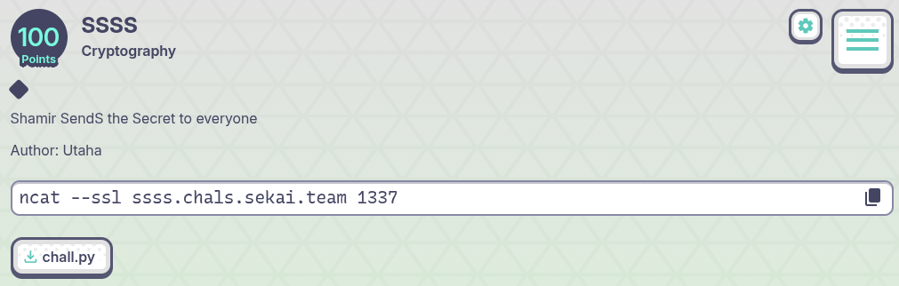

## SSSS - SekaiCTF 2025 Write-up



**Challenge:** SSSS
**Category:** Cryptography
**Points:** 100
**Author:** minouse3

### Introduction
The challenge description hinted at Shamir’s Secret Sharing — “Shamir SendS the Secret to everyone.”
We’re given a source file for the server, [**chall.py**](assets/files/chall.py) that generates a random polynomial over a large prime field. One of the coefficients of this polynomial is secretly the flag’s hidden value. Each round, we can query the polynomial at several points and must eventually guess the secret.

At first it seems impossible, because the secret could be placed in any random coefficient. But the catch is that the service runs two rounds with the same secret. This weakness makes it possible to recover the hidden value.

### Analyzing the [**chall.py**](assets/files/chall.py) file
Looking into the provided chall.py, the process works as follows. A large prime modulus $p = 2^{256} - 189$ defines the finite field. A random secret is chosen once and remains fixed across two rounds. In each round, the player first chooses an integer $t$ between 20 and 50, which determines the degree of a polynomial. The server generates a polynomial of that degree with random coefficients, then replaces one random coefficient with the secret. This means the secret might be anywhere: it could be the constant term, or the coefficient of $x^{17}$, or something else entirely.

After that, the server lets the player query the polynomial exactly $t$times. For each query, the player sends in some $x$, and the server returns &f(x)&, the polynomial evaluated at that point. Once the queries are over, the player must submit a single guess for the secret. If the guess matches the hidden value, the flag is revealed; otherwise, the round ends with a sad face `:<`.

The difficulty is clear: in one round, even if you interpolate the polynomial fully, you have no way of knowing which coefficient is the secret. But since the game runs twice with the same secret hidden in two different random polynomials, there’s a simple strategy: extract all the candidate coefficients from round one and round two, and take their intersection. The only value they have in common is the real secret.

### How to solve it
The key to solving this challenge is realizing that we can treat the polynomial evaluations like a discrete Fourier transform (DFT) over a finite field. Since we’re allowed to pick the evaluation points ourselves, the best choice is to use the powers of a primitive $t$-th root of unity. Doing this means that, when we query the polynomial at $1,g,g^2,...,g^{t-1}$, we essentially collect enough information to reconstruct all of its coefficients modulo $p$.

In the first round, we recover a set of candidate coefficients that could contain the secret. However, we don’t know which coefficient is actually the secret because it was inserted at a random index. That’s where the two-round weakness comes in. The server uses the same secret again in the second round, but with a completely new random polynomial. By repeating the DFT trick, we get a second set of candidate coefficients. The true secret is the only value that appears in both sets. So, by simply intersecting the two candidate lists, we can extract the secret with high confidence.

Once we have the secret, we just send it back to the server as the final guess, and in return, the flag is printed. The full solver code [**chall.py**](assets/files/ssss_solver.py) that implements this idea is shown below:
```py
#!/usr/bin/env python3
from pwn import remote, context
from math import gcd
from random import randrange

context.log_level = "info"

HOST = "ssss.chals.sekai.team"
PORT = 1337

# From chall: p is prime, two rounds share the same secret
p = (1 << 256) - 189
P_MINUS_1 = p - 1

def inv(x): return pow(x, p - 2, p)

def factors_small(n):
    f, d, m = {}, 2, n
    while d * d <= m:
        while m % d == 0:
            f[d] = f.get(d, 0) + 1
            m //= d
        d += 1
    if m > 1: f[m] = f.get(m, 0) + 1
    return f

def find_good_t():
    # Service expects 20 <= t <= 50 :contentReference[oaicite:1]{index=1}; pick a divisor of p-1
    for t in range(50, 19, -1):
        if P_MINUS_1 % t == 0:
            return t
    return 29

def order_is_exact(g, t, tf):
    if pow(g, t, p) != 1: return False
    for q in tf:
        if pow(g, t // q, p) == 1: return False
    return True

def gen_root_of_unity(t):
    tf = factors_small(t)
    for h in range(2, 300):
        g = pow(h, P_MINUS_1 // t, p)
        if g != 1 and order_is_exact(g, t, tf):
            return g
    raise RuntimeError("no t-th root of unity found")

def dft_coeffs_from_samples(y, g, t):
    inv_g, inv_t = inv(g), inv(t)
    S0 = sum(yj % p for yj in y) % p
    coeffs = {}
    for k in range(1, t):
        base = pow(inv_g, k, p)
        r, Sk = 1, 0
        for j in range(t):
            Sk = (Sk + (y[j] % p) * r) % p
            r = (r * base) % p
        coeffs[k] = (Sk * inv_t) % p
    return coeffs, S0

def read_int_line(io):
    """Read lines until one parses as base-10 int (skips ':<' and any noise)."""
    while True:
        line = io.recvline(timeout=10)
        if not line:
            raise EOFError("Connection closed.")
        s = line.strip()
        try:
            return int(s)
        except ValueError:
            # swallow lines like b':<' (wrong-guess marker) or blanks
            continue

def one_round(io, t, xs):
    io.sendline(str(t).encode())
    ys = []
    for x in xs:
        io.sendline(str(x).encode())
        y = read_int_line(io)
        ys.append(y)
    return ys

def consume_wrong_marker(io):
    """After sending a wrong guess, the server prints ':<' once. Eat it."""
    try:
        line = io.recvline(timeout=5)
        # don't care what it is; just clear it if present
    except EOFError:
        pass

def solve():
    t = find_good_t()
    print(f"[i] Using t = {t} (since t | p-1)")

    g = gen_root_of_unity(t)
    xs = [1]
    for _ in range(1, t):
        xs.append((xs[-1] * g) % p)

    # Connect with TLS; service runs two rounds with same secret :contentReference[oaicite:2]{index=2}
    io = remote(HOST, PORT, ssl=True, sni=HOST)

    # -------- Round 1 --------
    y1 = one_round(io, t, xs)
    coeffs1, S01 = dft_coeffs_from_samples(y1, g, t)

    # Force round 2: intentionally wrong guess (any number ≠ secret)
    io.sendline(b"0")
    # The server prints ':<' on wrong guess — we must consume it :contentReference[oaicite:3]{index=3}
    consume_wrong_marker(io)

    # -------- Round 2 --------
    y2 = one_round(io, t, xs)
    coeffs2, S02 = dft_coeffs_from_samples(y2, g, t)

    cand1 = set(coeffs1.values())
    cand2 = set(coeffs2.values())
    inter = list(cand1 & cand2)

    if inter:
        secret = inter[0]
        print("[+] Found secret via DFT intersection.")
    else:
        secret = next(iter(cand2))
        print("[!] No intersection; picking a round-2 candidate (still likely).")

    io.sendline(str(secret).encode())

    # Print server output (flag or ':<')
    try:
        while True:
            line = io.recvline(timeout=3)
            if not line: break
            print(line.decode(errors="ignore").rstrip())
    except EOFError:
        pass
    io.close()

if __name__ == "__main__":
    solve()
```
After running the script, we will get the flag from the server, confirming that the DFT intersection strategy works.
```sh
┌──(minouse3㉿kali)-[~]
└─$ python3 ssss_solver.py
[i] Using t = 29 (since t | p-1)
[<] Opening connection to ssss.chals.sekai.team on port 1337: Trying 34.133.17.1[+] Opening connection to ssss.chals.sekai.team on port 1337: Done
[+] Found secret via DFT intersection.
SEKAI{https://youtu.be/XGxIE1hr0w4}
[*] Closed connection to ssss.chals.sekai.team port 1337
```

### Flag
```
SEKAI{https://youtu.be/XGxIE1hr0w4}
```