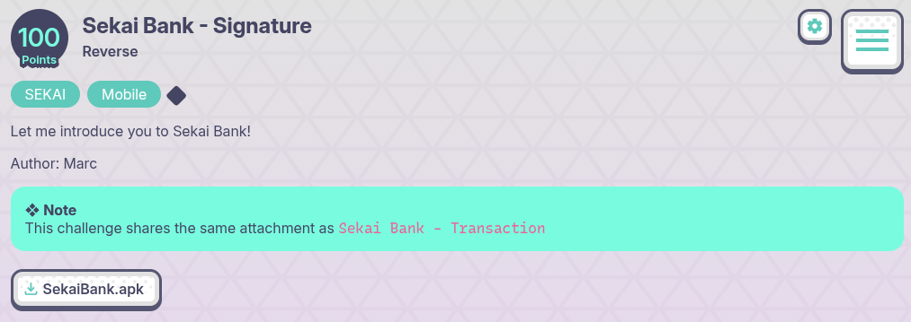
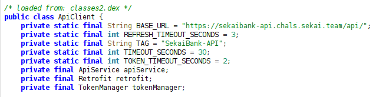
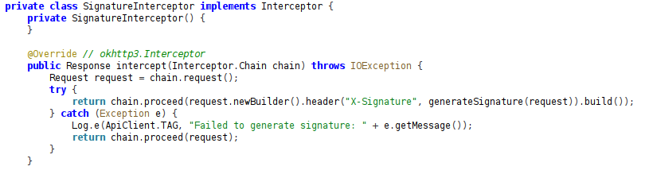
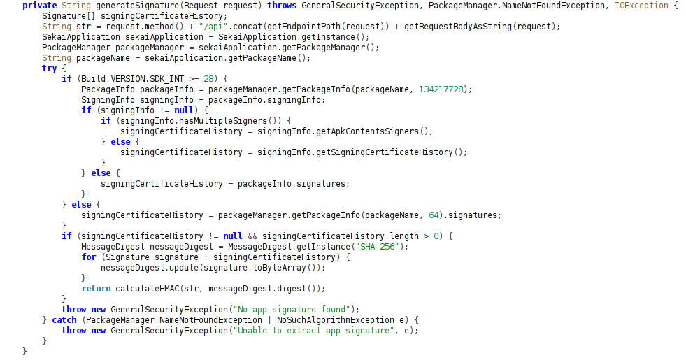

## Sekai Bank - Signature - SekaiCTF 2025 Write-up



**Challenge:** Sekai Bank - Signature
**Category:** Reverse
**Points:** 100
**Author:** minouse3

### Introduction
For this challenge I was given an APK called [**SekaiBank.apk**](assets/files/SekaiBank.apk) and told to figure out how it works. The app clearly talks to some backend and, from the name of the challenge, I suspected it had something to do with request signing. My plan was to drop the APK into JADX, dig through the code until I found the interesting bits, and then try to replicate the signing routine myself to pull the flag directly from the API.

### Analyzing the [**SekaiBank.apk**](assets/files/SekaiBank.apk) file
I started by loading the APK into JADX and poking around the main package, `com.sekai.bank`. One of the first places I looked was the networking layer. Inside `com.sekai.bank.network.ApiClient` I found a constant called `BASE_URL`. That gave away the server straight away:



```java
public static final String BASE_URL = "https://sekaibank-api.chals.sekai.team/api/";
```

That told me exactly which server the app was calling. In the same class, I saw that the app attached a few interceptors to its OkHttp client. One of them, `SignatureInterceptor`, was responsible for generating and attaching an `X-Signature` header.



Looking at the code in `generateSignature`, I could see that it builds a canonical string from four parts: the HTTP method, the literal `"/api"`, the endpoint path (with the base URL stripped), and finally the request body. If the request had no body or was multipart/form-data, it simply used `"{}"`. Otherwise it took the exact UTF-8 body as a string. This is important because the body is expected to be JSON — meaning if I sent anything, it needed to be serialized in exactly the same way, with the `Content-Type` header set to `application/json`. Any differences in whitespace or formatting would change the signature and cause the server to reject the request.



The app then signed that canonical string using HMAC-SHA256. For the key, it didn’t use a hardcoded secret. Instead, it loaded its own signing certificate from the system, hashed its raw DER bytes with SHA-256, and used that digest as the HMAC key. Since I had the APK, I could do the same on my end. Running:
```bash
┌──(minouse3㉿kali)-[~]
└─$ apksigner verify --print-certs SekaiBank.apk
Signer #1 certificate DN: C=ID, ST=Bali, L=Indonesia, O=HYPERHUG, OU=Development, CN=Aimar S. Adhitya
Signer #1 certificate SHA-256 digest: 3f3cf8830acc96530d5564317fe480ab581dfc55ec8fe55e67dddbe1fdb605be
Signer #1 certificate SHA-1 digest: 2c9760ee9615adabdee0e228aed91e3d4ebdebdf
Signer #1 certificate MD5 digest: fcab4af1f7411b4ba70ec2fa915dee8e
```
gave me the signer’s SHA-256 digest:
```
3f3cf8830acc96530d5564317fe480ab581dfc55ec8fe55e67dddbe1fdb605be
```
That was the exact HMAC key the app used.

### How to get the flag
With the key and the signing scheme figured out, the next step was finding the right endpoint. While browsing the model classes, I spotted one called FlagRequest, which hinted at an endpoint /api/flag. Other strings in the code mentioned an unmask_flag parameter, so I prepared a JSON body:
```
{"unmask_flag":true}
```

Because the interceptor signs the raw body string, I had to be careful to use this exact JSON without extra spaces. The canonical string for the request therefore looked like:
```
POST/api/flag{"unmask_flag":true}
```

Using the cert digest as the HMAC key and that canonical string as the message, I computed the `X-Signature` like this in Python (you can do the same with any HMAC tool):
```py
import hmac, hashlib
key_hex = "3f3cf8830acc96530d5564317fe480ab581dfc55ec8fe55e67dddbe1fdb605be"
key = bytes.fromhex(key_hex)
msg = b'POST/api/flag{"unmask_flag":true}'
sig = hmac.new(key, msg, hashlib.sha256).hexdigest().lower()
print(sig)
```

That prints the exact value of `X-Signature`:
```sh
┌──(minouse3㉿kali)-[~]
└─$ python3 xsign.py
440ba2925730d137259f297fd6fba02af2f7b6c414dd16a1ac336e9047cdb8f5
```

When sending the request with `curl`, I had to be extra careful. If I used `-d` (the short form for `--data`), curl would normalize the data by appending a newline or converting it to `application/x-www-form-urlencoded`. That would subtly change the raw body and make the signature invalid. Using `--data-binary` ensures curl sends the body exactly as I typed it, byte-for-byte, with no modifications. Since the signature is computed over the raw JSON string, any tiny difference would result in a mismatch.

The final request looked like this:
```sh
curl -s -X POST 'https://sekaibank-api.chals.sekai.team/api/flag' \
  -H 'Content-Type: application/json' \
  -H 'X-Signature: 440ba2925730d137259f297fd6fba02af2f7b6c414dd16a1ac336e9047cdb8f5' \
  --data-binary '{"unmask_flag":true}'
```
And with that, the server returned the flag.
```sh
┌──(minouse3㉿kali)-[~]
└─$ curl -s -X POST 'https://sekaibank-api.chals.sekai.team/api/flag' \
  -H 'Content-Type: application/json' \
  -H 'X-Signature: 440ba2925730d137259f297fd6fba02af2f7b6c414dd16a1ac336e9047cdb8f5' \
  --data-binary '{"unmask_flag":true}'

SEKAI{are-you-ready-for-the-real-challenge?}
```

### Flag
```
SEKAI{are-you-ready-for-the-real-challenge?}
```