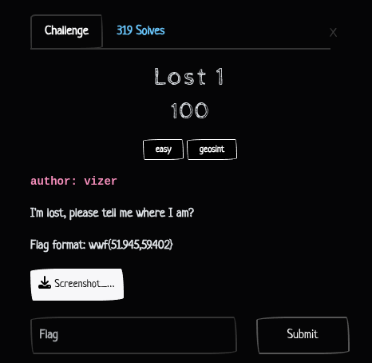
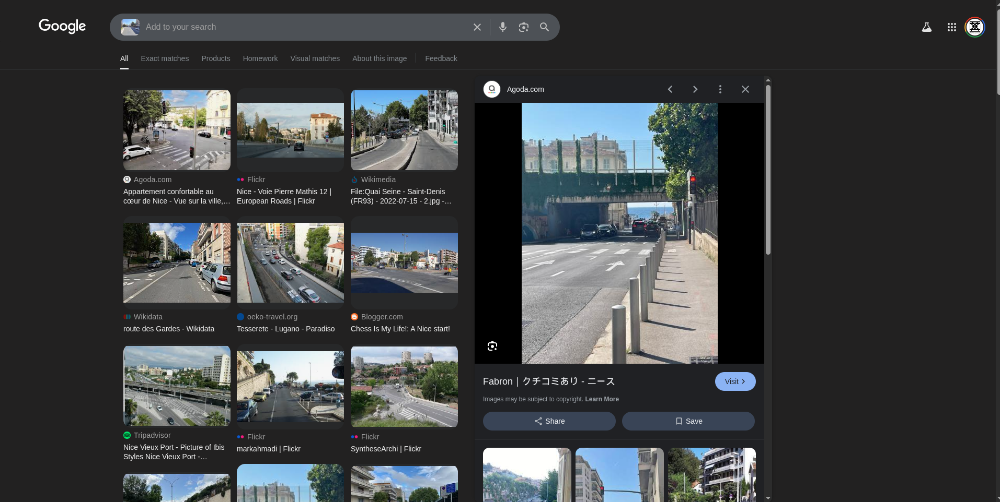
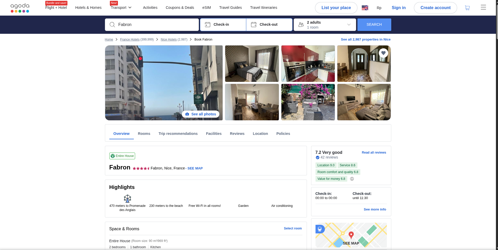
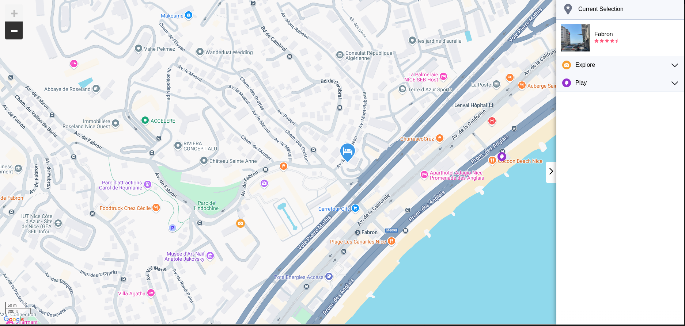
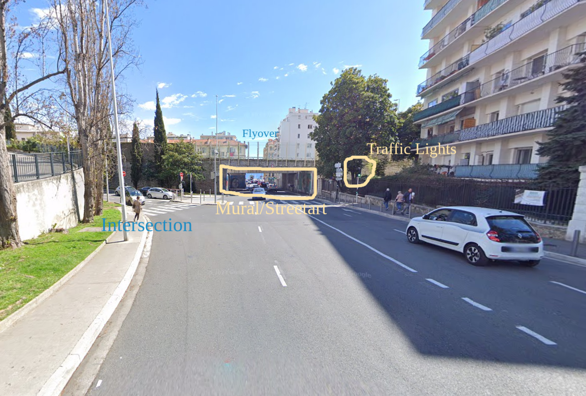
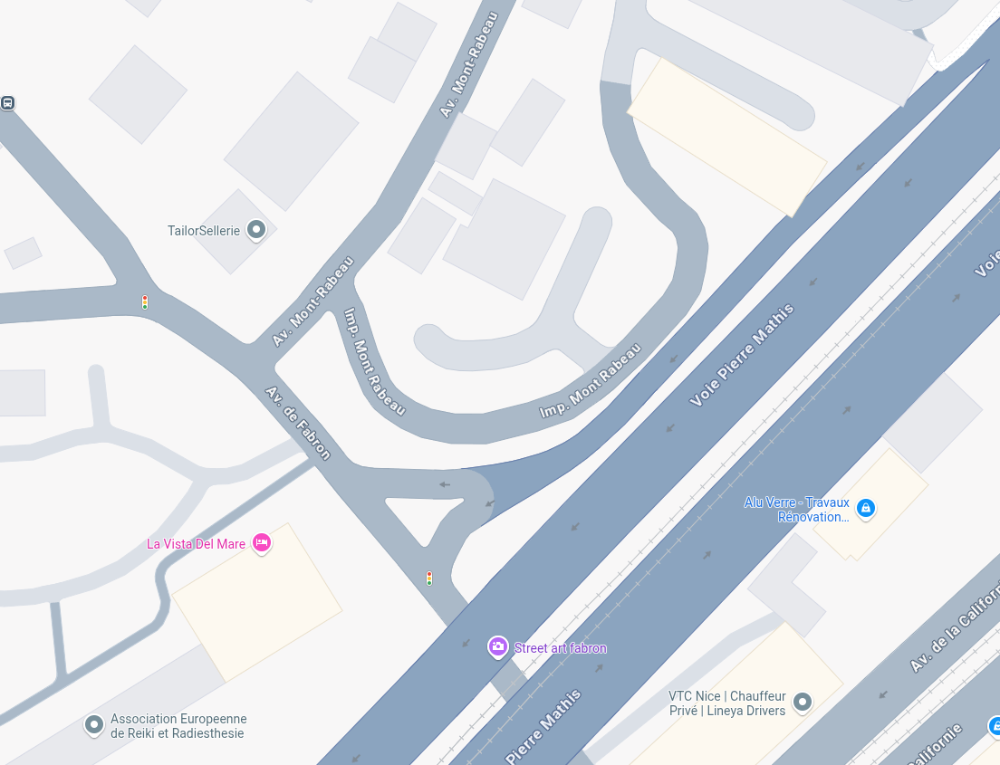
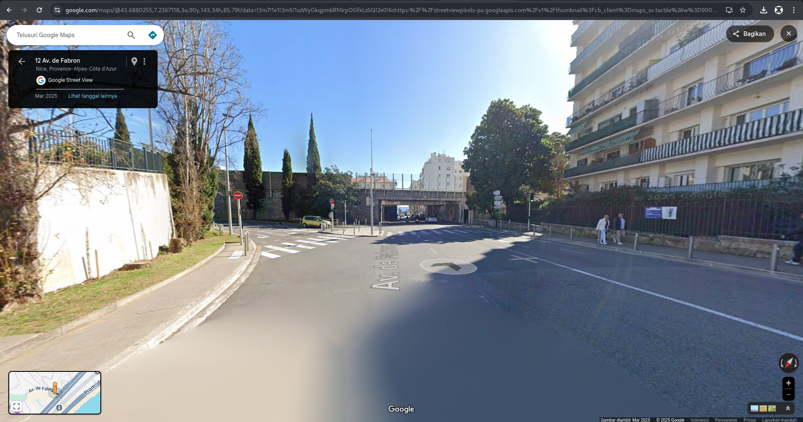

## Lost 1 - WWCTF 2025 Write-up



**Challenge:** Lost 1
**Category:** OSINT, GeOSINT
**Points:** 100
**Author:** MinousE3

### Introduction
**Lost 1** is part of the GeOSINT category from WWCTF, where the goal is to determine the exact geographical coordinates of the location shown in the image.

In this challenge, we’re given a [**Street View image**](assets/img/Screenshot_2025-03-29_164005.png) and a simple request: 
> *"I'm lost, please tell me where I am?"* 


The final flag should be in the format:
```
wwf{51.945,59.402}
```

### Pinpointing the Location
To begin solving the challenge, I used Google Lens to perform a reverse image search on the provided Street View image. One of the top results led me to [**a listing on Agoda for a hotel located in Fabron, Nice, France**](https://www.agoda.com/en-gb/fabron-h33056264/hotel/nice-fr.html?cid=1844104&ds=ztTOVd%2FSRPhuPyug). The Agoda page even displays a preview image with a nearly identical view to the challenge image, confirming that we were in the correct area.




From there, I used the hotel's location to narrow the search down. The listing indicates it is situated on Avenue Mont-Rabeau, so I shifted my focus to the surrounding streets. 



Analyzing the original challenge image, I noted several key features: an overpass, traffic lights, an intersection, and a distinctive street art mural beneath the overpass.



Switching to Google Maps, I began exploring the surrounding area—specifically near Avenue de Fabron and Voie Pierre Mathis, which near Avenue Mont-Rabeau. Sure enough, I found a spot matching all the visual clues, including two traffic lights, a road going under the flyover, and the same wall mural labeled Streetart Fabron.



Finally, using Google Street View, I adjusted the viewpoint until it perfectly matched the one from the challenge image. The location was now confirmed, and [**the exact coordinates**](https://maps.app.goo.gl/EPe6vkoFErNwjA2Y6) could be extracted directly from Google Maps to complete the flag.



### Flag
After confirming the exact location via Google Street View, we retrieved the coordinates:
> **Latitude**: 43.6880255 <br>
**Longitude**: 7.2367118

Since the challenge specifies a flag format of `wwf{latitude,longitude}` and we are only to include up to three digits after the decimal, we round both values accordingly:

```
wwf{43.688,7.236}
```
