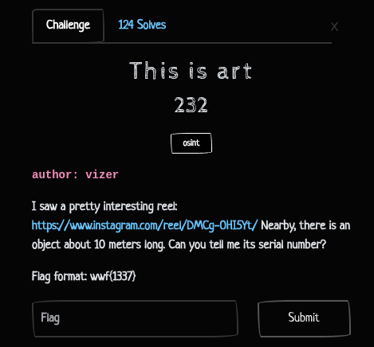
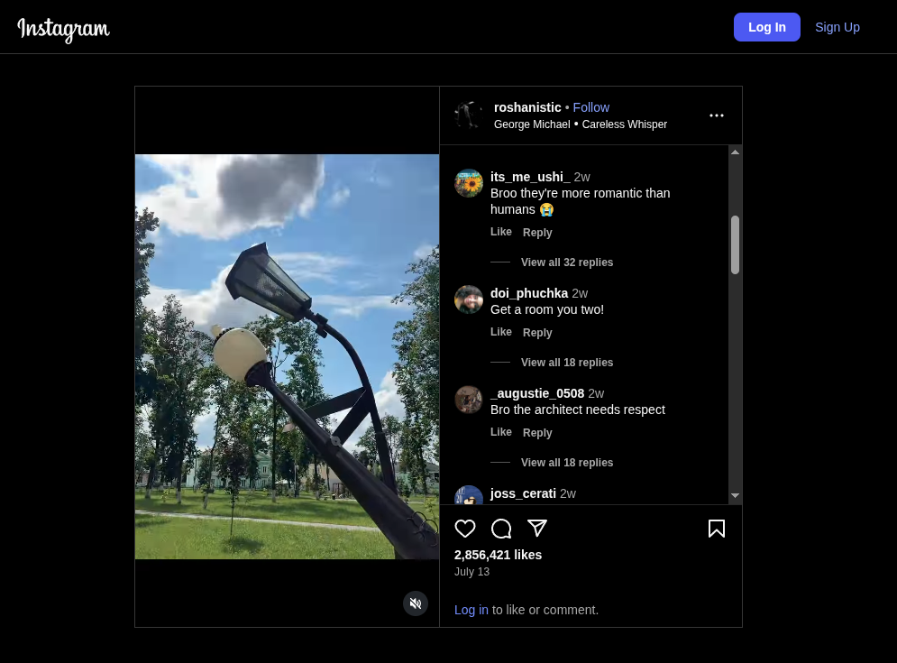
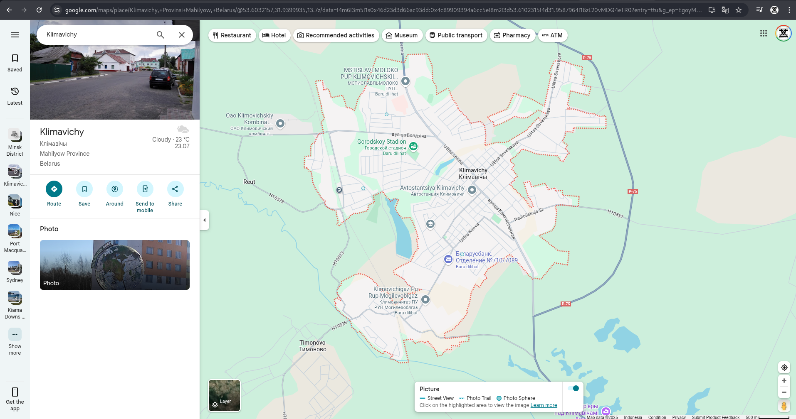
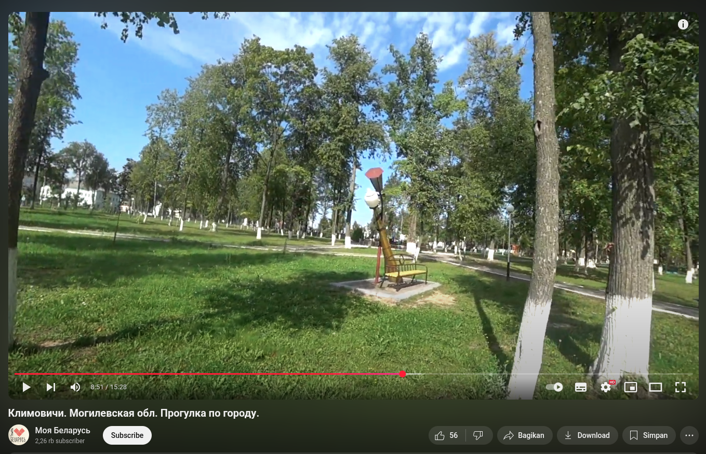
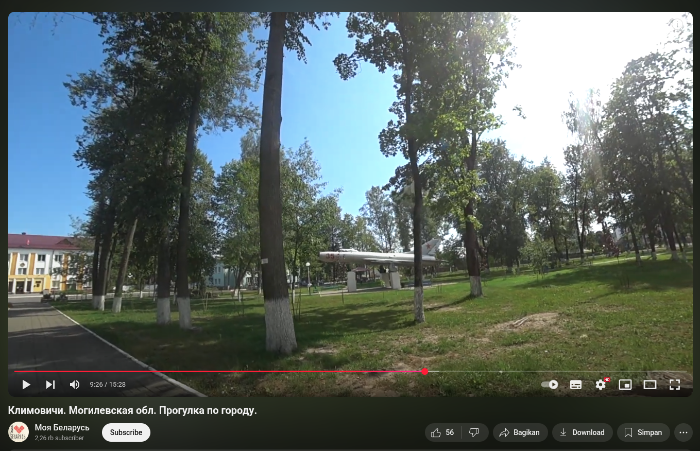

## This is art - WWCTF 2025 Write-up



**Challenge:** This is art
**Category:** OSINT
**Points:** 232
**Author:** MinousE3

### Introduction
In the “This is art” challenge from the OSINT category of WWCTF, we're given a link to an [**Instagram reel**](https://www.instagram.com/reel/DMCg-OHI5Yt/) and a brief clue: 
> *nearby the location shown in the video, there is an object approximately 10 meters long, and our task is to identify its serial number.*

The flag should be submitted in the format:
```
wwf{1337}
```

### Tracking Clues Through Reels
Opening the provided [**Instagram reel**](https://www.instagram.com/reel/DMCg-OHI5Yt/), we’re shown a viral, romantic-style video featuring two street lamps designed to look like they’re hugging—a charming piece of public art. At first, I tried to mine the comments section for any hints about the location, but most of the replies were focused entirely on the streetlamps themselves and offered no useful information.



So, I took a more direct OSINT approach: I captured a screenshot of the streetlamps from the reel and ran it through Google Lens. Initially, the results included several reposts of the same content across TikTok, Instagram, and YouTube Shorts, but nothing revealing the location. To refine the search, I used the "Exact Matches" feature in Google Lens to force results that matched the screenshot precisely.


After some scrolling, I stumbled upon a TikTok video that stood out—this one included a caption in what looked like Russian:
[**"Романтика до фонаря в Климовичах"**](https://www.tiktok.com/@platform375mogilev/video/7527315839264083205)


Curious, I translated the phrase and discovered it means:
"Romance to the point of oblivion in Klimovichi"
This was the breakthrough: the hugging streetlamps are located in Klimovichi, Belarus (Климовичи in Cyrillic).


Unfortunately, Klimovichi has no Google Street View coverage, so I needed a different way to explore the area visually. 



I returned to the TikTok video and noticed that parts of the footage were taken from a YouTube video. Looking closer, I found it was from a channel called [**Моя Беларусь**](https://www.youtube.com/@MyBelarus-Live) ("My Belarus"). 


After digging through the channel, I located the full video:
[**Климовичи. Могилевская обл. Прогулка по городу**](https://www.youtube.com/watch?v=ECCGHOYVz8M)


At around 8:45, the video shows the same hugging streetlamps, confirming we’re in the right place. 



Continuing to watch, at 9:25, a new object comes into view: a retired Soviet jet fighter on public display, parked just meters away from the lamps. This plane fit the challenge description perfectly: about 10 meters long, and likely to have a serial number.



I took a screenshot of the jet and ran it through Google Lens. One of the image matches led to a page on [**JetPhotos**](https://www.jetphotos.com/airport/Other+Location+-+Klimovichi) with the same plane, and importantly, the location was listed as Klimovichi. 


The aircraft was identified as a Sukhoi SU-9, originally from the Soviet Union Air Force, and the page provided the serial number:
```
1315390
```


### Flag
After identifying the aircraft as a Sukhoi SU-9 on display in Klimovichi and confirming the serial number via JetPhotos, we found that the correct flag is:

```
wwf{1315390}
```
