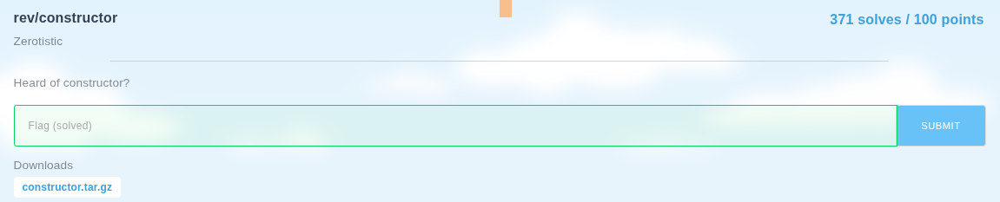

## constructor - idekCTF 2025 Write-up



**Challenge:** constructor
**Category:** Reverse
**Points:** 100
**Author:** minouse3

### Introduction
This challenge dropped us an ELF 64‑bit Linux binary executable called [**chall**](assets/files/chall) with the tagline:

> Heard of constructor?

In compiled C or C++ binaries, constructors or static initialization functions can execute before main(). This means that even if the main function appears to be empty, the program can still run hidden logic in special functions registered as constructors.

### Analyzing the [**chall**](assets/files/chall) file
I started my analysis by opening the `entry` function in Ghidra. The decompiled code was short but revealing:

```cpp
void processEntry entry(void)

{
  FUN_004011b0();
  FUN_00401570(&LAB_00401170,*(undefined4 *)register0x00000020,
               (undefined4 *)((long)register0x00000020 + 8),FUN_00401000,FUN_004026d4,0);
  return;
}
```

This code was calling two functions, but the more interesting one was clearly `FUN_00401570`, which had multiple parameters, including a function pointer. This type of setup usually handles program initialization or dynamic constructor calls. I double‑clicked into `FUN_00401570` to see what was happening there:

```cpp
void FUN_00401570(code *param_1,undefined8 *param_2,undefined8 *param_3)

{
  undefined8 uVar1;
  undefined8 uVar2;
  undefined8 uVar3;
  uint uVar4;
  undefined8 *extraout_RDX;
  undefined8 *puVar5;
  long unaff_RBX;
  undefined8 *unaff_RBP;
  ulong uVar6;
  code *pcVar7;
  code *unaff_R12;
  undefined8 *unaff_R13;
  
  do {
    pcVar7 = param_1;
    puVar5 = param_3;
    *(code **)((long)register0x00000020 + -8) = unaff_R12;
    *(undefined8 **)((long)register0x00000020 + -0x10) = unaff_RBP;
    *(long *)((long)register0x00000020 + -0x18) = unaff_RBX;
    uVar1 = *puVar5;
    *(undefined8 *)((long)register0x00000020 + -0x20) = 0x401591;
    FUN_004012c0(puVar5 + (long)(int)param_2 + 1,uVar1);
    uVar6 = (ulong)param_2 & 0xffffffff;
    uVar1 = *(undefined8 *)((long)register0x00000020 + -0x18);
    uVar2 = *(undefined8 *)((long)register0x00000020 + -0x10);
    uVar3 = *(undefined8 *)((long)register0x00000020 + -8);
    *(undefined8 **)((long)register0x00000020 + -8) = unaff_R13;
    unaff_RBX = (long)(int)param_2;
    *(undefined8 *)((long)register0x00000020 + -0x10) = uVar3;
    unaff_R13 = puVar5 + unaff_RBX + 1;
    *(undefined8 *)((long)register0x00000020 + -0x18) = uVar2;
    *(undefined8 *)((long)register0x00000020 + -0x20) = uVar1;
    *(undefined8 *)((long)register0x00000020 + -0x30) = 0x401554;
    FUN_004014f0();
    *(undefined8 *)((long)register0x00000020 + -0x30) = 0x40155f;
    param_2 = puVar5;
    uVar4 = (*pcVar7)(uVar6,puVar5,unaff_R13);
    param_1 = (code *)(ulong)uVar4;
    *(undefined8 *)((long)register0x00000020 + -0x30) = 0x401566;
    FUN_00401010();
    param_3 = extraout_RDX;
    register0x00000020 = (BADSPACEBASE *)((long)register0x00000020 + -0x28);
    unaff_RBP = puVar5;
    unaff_R12 = pcVar7;
  } while( true );
}
```

The function was looping, setting up stack frames, and repeatedly calling a function pointer `*pcVar7`. This strongly indicated that it was orchestrating the program’s pre‑`main` execution, calling hidden routines one by one. However, this function alone didn’t show any strings or logic that looked like a flag check, so I shifted my strategy to string analysis.

Using Defined Strings in Ghidra, I searched for anything that might indicate success or failure. One string immediately stood out:

```
00403013  |	 Correct!  |  "Correct!"  |  ds
```

Ghidra displayed it like this:

```cpp
s_Correct!_00403013                XREF[1]: FUN_00401050:00401159(*)
00403013 43 6f 72  ds "Correct!"
         72 65 63 
         74 21 00
```

The string had only one cross reference, which led straight to a function named `FUN_00401050`. Since this string was clearly printed when the flag was correct, I knew I had found the core flag checking routine. Opening `FUN_00401050` revealed the following code:

```cpp
void FUN_00401050(void)

{
  byte bVar1;
  int iVar2;
  ulong uVar3;
  long lVar4;
  long lVar5;
  byte bVar6;
  long in_FS_OFFSET;
  undefined1 auStack_1038 [4104];
  long local_30;
  
  bVar6 = 0;
  local_30 = *(long *)(in_FS_OFFSET + 0x28);
  uVar3 = 0;
  do {
    bVar1 = (&DAT_00403040)[uVar3] ^ bVar6;
    bVar6 = bVar6 + 0x1f;
    (&DAT_00405140)[uVar3] = bVar1 ^ (byte)(uVar3 >> 1) ^ 0x5a;
    uVar3 = uVar3 + 1;
  } while (uVar3 != 0x2a);
  DAT_0040516a = 0;
  iVar2 = FUN_00401670("/proc/self/cmdline",0);
  if (-1 < iVar2) {
    lVar4 = FUN_00401a10(iVar2,auStack_1038,0xfff);
    FUN_004019c0(iVar2);
    if (0 < lVar4) {
      auStack_1038[lVar4] = 0;
      lVar5 = FUN_00401830(auStack_1038,0,lVar4);
      if ((lVar5 != 0) && ((undefined1 *)(lVar5 + 1U) < auStack_1038 + lVar4)) {
        iVar2 = FUN_00401910((undefined1 *)(lVar5 + 1U),&DAT_00405140);
        if (iVar2 == 0) {
          FUN_00401770("Correct!");
        }
        else {
          FUN_00401770(&DAT_0040301c);
        }
        FUN_00401010(0);
      }
    }
  }
  if (local_30 == *(long *)(in_FS_OFFSET + 0x28)) {
    return;
  }
                    /* WARNING: Subroutine does not return */
  FUN_00401610();
}
```

Reading this function step by step makes the challenge’s intent very clear. The program first loops through 42 bytes stored at the memory address `DAT_00403040`. For each byte, it applies a simple XOR decoding routine. The decoding uses a “rolling key” that starts at 0 and increases by `0x1F` for each byte. After that, the code XORs the intermediate value with `(index >> 1) ^ 0x5A` before storing the result into `DAT_00405140`. This produces a decoded string in memory.

After the decoding is done, the program reads `/proc/self/cmdline` to grab its own command‑line arguments, extracts `argv[1]`, and compares it to the decoded string. If the two match, the program prints `"Correct!"`. Otherwise, it prints a different message and exits.

From this, the binary’s behavior is clear: the flag is stored in the binary, XOR‑encoded, and will only trigger success if passed as the first argument.

### How to solve it

The most efficient way to solve this challenge is to replicate the XOR decoding in a separate script instead of trying to guess the flag manually. The 42 encoded bytes from `DAT_00403040` are:

```
33 21 00 6d 5f ab 86 b4 d4 2d 36 3a 4e 90 8c e3 cc 2e 09 6c 49 b8 8f f7 cc 22 4e 4d 5e b8 80 cb d3 da 20 29 70 02 b7 d1 b7 c4
```

To automate the decoding, I wrote a small Python script named [constructor_solve.py](assets/files/constructor_solve.py) that implements the same logic from `FUN_00401050`:

```py
encoded = [
    0x33,0x21,0x00,0x6d,0x5f,0xab,0x86,0xb4,
    0xd4,0x2d,0x36,0x3a,0x4e,0x90,0x8c,0xe3,
    0xcc,0x2e,0x09,0x6c,0x49,0xb8,0x8f,0xf7,
    0xcc,0x22,0x4e,0x4d,0x5e,0xb8,0x80,0xcb,
    0xd3,0xda,0x20,0x29,0x70,0x02,0xb7,0xd1,
    0xb7,0xc4
]

decoded = []
rolling_key = 0
for i, val in enumerate(encoded):
    tmp = val ^ rolling_key
    decoded.append(tmp ^ (i >> 1) ^ 0x5A)
    rolling_key = (rolling_key + 0x1F) & 0xFF

flag = ''.join(chr(x) for x in decoded)
print(flag)
```

Running the script produces:

```
idek{he4rd_0f_constructors?_now_you_d1d!!}
```

Passing this string as the first argument to the binary confirms the result:
```bash
┌──(minouse3㉿kali)-[~]
└─$ ./chall 'idek{he4rd_0f_constructors?_now_you_d1d!!}'
Correct!
```

### Flag
```
idek{he4rd_0f_constructors?_now_you_d1d!!}
```